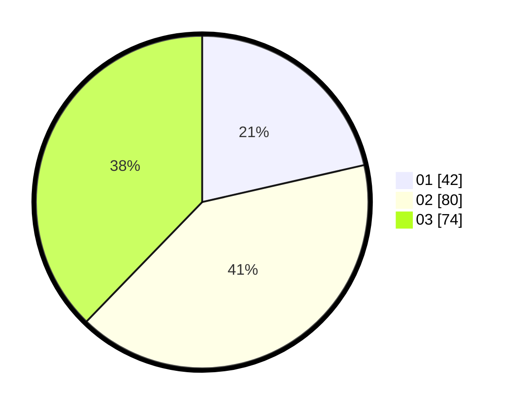

# Hasil

Hasil perolehan suara paslon dapat dilihat pada file paslon-01.txt, paslon-02.txt, dan paslon-03.txt.

Jika tidak ada, artinya data tersebut belum ada pada SIREKAP.

## Perolehan Suara

 * Paslon 01: **42**.
 * Paslon 02: **80**.
 * Paslon 03: **74**.

## Foto C Plano

https://sirekap-obj-formc.kpu.go.id/ecf8/pemilu/ppwp/31/73/05/10/05/3173051005043-20240214-190415--a3c7e9c1-3811-43df-8c72-b932d08ff4c0.jpg

https://sirekap-obj-formc.kpu.go.id/ecf8/pemilu/ppwp/31/73/05/10/05/3173051005043-20240214-194259--3ed4110d-9086-421f-9004-393d0b18ac77.jpg

https://sirekap-obj-formc.kpu.go.id/ecf8/pemilu/ppwp/31/73/05/10/05/3173051005043-20240214-194417--cff5341d-3aa1-4925-9127-5f166a9b7e43.jpg

## DATA PEMILIH TETAP

Jumlah pemilih dalam DPT: **290**.
 * L: **141**.
 * P: **149**.

## DATA PENGGUNA HAK PILIH

Jumlah pengguna hak pilih dalam DPT: **196**.
 * L: **93**.
 * P: **103**.

Jumlah pengguna hak pilih dalam DPTb: **0**.
 * L: **0**.
 * P: **0**.

Jumlah pengguna hak pilih dalam DPK: **1**.
 * L: **0**.
 * P: **1**.

Jumlah pengguna hak pilih: **197**.
 * L: **93**.
 * P: **104**.

## JUMLAH SUARA SAH DAN TIDAK SAH

JUMLAH SELURUH SUARA SAH: **196**.

JUMLAH SUARA TIDAK SAH: **1**.

JUMLAH SELURUH SUARA SAH DAN SUARA TIDAK SAH: **197**.
