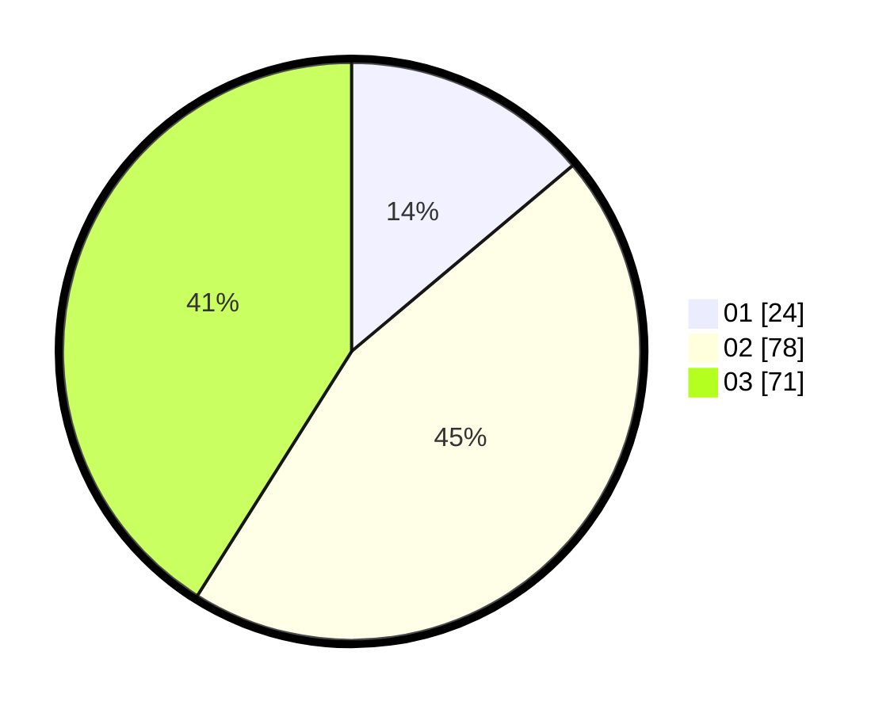

# Hasil

Hasil perolehan suara paslon dapat dilihat pada file paslon-01.txt, paslon-02.txt, dan paslon-03.txt.

Jika tidak ada, artinya data tersebut belum ada pada SIREKAP.

## Perolehan Suara

 * Paslon 01: **24**.
 * Paslon 02: **78**.
 * Paslon 03: **71**.

## Foto C Plano

https://sirekap-obj-formc.kpu.go.id/06ba/pemilu/ppwp/31/73/05/10/05/3173051005047-20240215-003804--ca037b1c-bed8-4b84-abae-2da7bfe94ee0.jpg

https://sirekap-obj-formc.kpu.go.id/06ba/pemilu/ppwp/31/73/05/10/05/3173051005047-20240215-003957--5ad45092-6d6e-49a5-b7d7-102a48b09999.jpg

https://sirekap-obj-formc.kpu.go.id/06ba/pemilu/ppwp/31/73/05/10/05/3173051005047-20240215-004051--29ac5e71-141c-4c86-821f-00914d37ba3e.jpg
