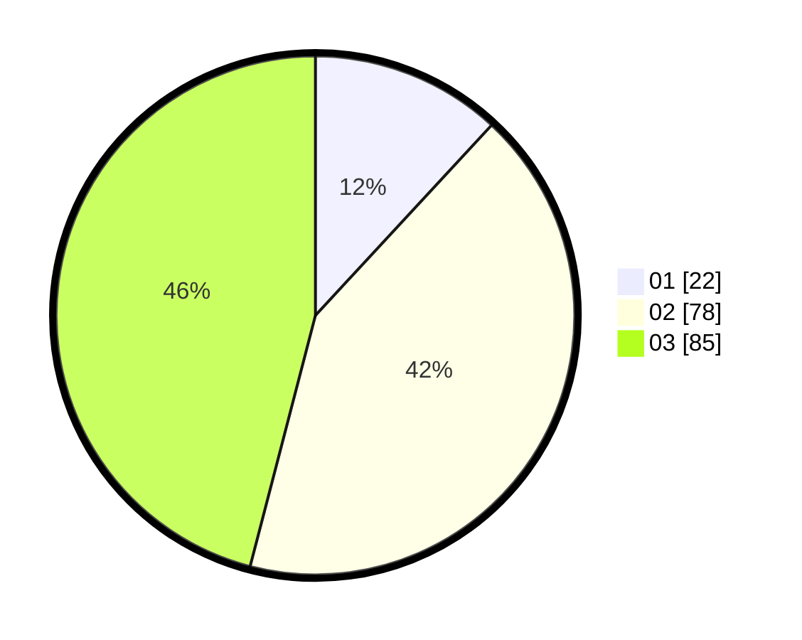

# Hasil

Hasil perolehan suara paslon dapat dilihat pada file paslon-01.txt, paslon-02.txt, dan paslon-03.txt.

Jika tidak ada, artinya data tersebut belum ada pada SIREKAP.

## Perolehan Suara

 * Paslon 01: **22**.
 * Paslon 02: **78**.
 * Paslon 03: **85**.

## Foto C Plano

https://sirekap-obj-formc.kpu.go.id/cb75/pemilu/ppwp/31/73/05/10/05/3173051005048-20240214-231635--25cedb2d-903c-4a1d-a23f-bd23cfc1cbca.jpg

https://sirekap-obj-formc.kpu.go.id/cb75/pemilu/ppwp/31/73/05/10/05/3173051005048-20240214-231805--6e60d083-b45a-494d-a466-a2072366276b.jpg

https://sirekap-obj-formc.kpu.go.id/cb75/pemilu/ppwp/31/73/05/10/05/3173051005048-20240214-234647--e45b0fc4-5b0b-4f0a-818c-af5680dc04f2.jpg
