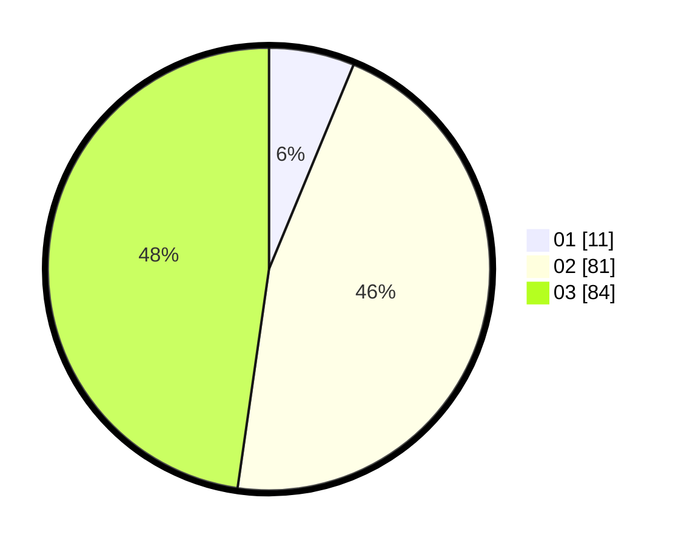

# Hasil

Hasil perolehan suara paslon dapat dilihat pada file paslon-01.txt, paslon-02.txt, dan paslon-03.txt.

Jika tidak ada, artinya data tersebut belum ada pada SIREKAP.

## Perolehan Suara

 * Paslon 01: **11**.
 * Paslon 02: **81**.
 * Paslon 03: **84**.

## Foto C Plano

https://sirekap-obj-formc.kpu.go.id/2850/pemilu/ppwp/31/73/05/10/05/3173051005049-20240214-194910--183845ea-f11e-4e20-9cc1-ad7fb7661a66.jpg

https://sirekap-obj-formc.kpu.go.id/2850/pemilu/ppwp/31/73/05/10/05/3173051005049-20240214-175305--e7c04d2d-fc57-45ec-8ccb-f68ea96aaef4.jpg

https://sirekap-obj-formc.kpu.go.id/2850/pemilu/ppwp/31/73/05/10/05/3173051005049-20240214-195134--9005af45-f512-4543-80b9-0652dc2ebd92.jpg

## DATA PEMILIH TETAP

Jumlah pemilih dalam DPT: **282**.
 * L: **134**.
 * P: **148**.

## DATA PENGGUNA HAK PILIH

Jumlah pengguna hak pilih dalam DPT: **175**.
 * L: **78**.
 * P: **97**.

Jumlah pengguna hak pilih dalam DPTb: **3**.
 * L: **0**.
 * P: **3**.

Jumlah pengguna hak pilih dalam DPK: **1**.
 * L: **0**.
 * P: **1**.

Jumlah pengguna hak pilih: **179**.
 * L: **78**.
 * P: **101**.

## JUMLAH SUARA SAH DAN TIDAK SAH

JUMLAH SELURUH SUARA SAH: **176**.

JUMLAH SUARA TIDAK SAH: **3**.

JUMLAH SELURUH SUARA SAH DAN SUARA TIDAK SAH: **179**.
