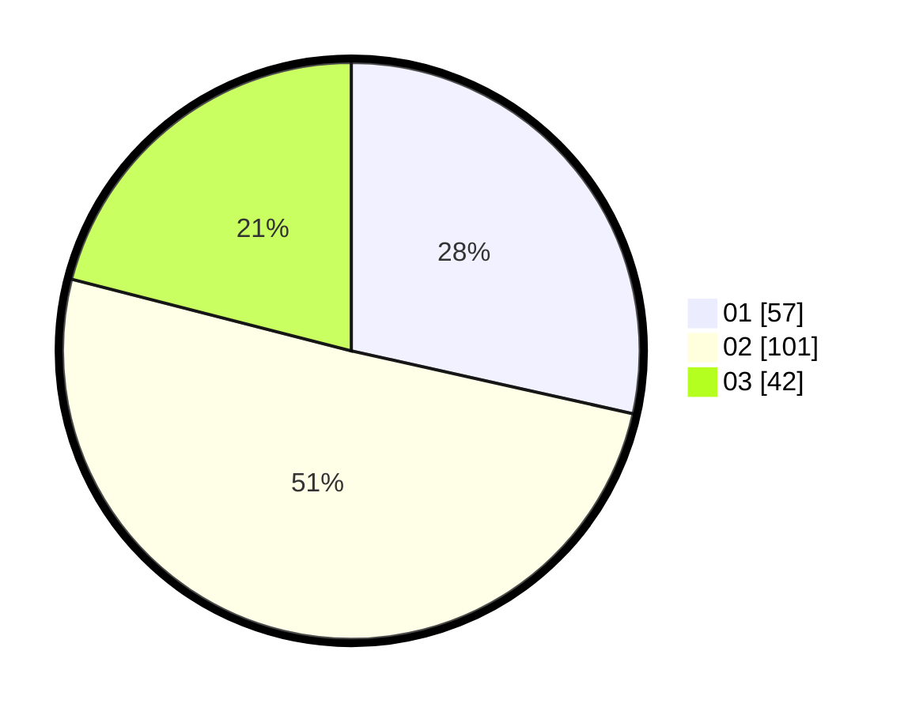

# Hasil

Hasil perolehan suara paslon dapat dilihat pada file paslon-01.txt, paslon-02.txt, dan paslon-03.txt.

Jika tidak ada, artinya data tersebut belum ada pada SIREKAP.

## Perolehan Suara

 * Paslon 01: **57**.
 * Paslon 02: **101**.
 * Paslon 03: **42**.

## Foto C Plano

https://sirekap-obj-formc.kpu.go.id/ee39/pemilu/ppwp/31/73/05/10/05/3173051005058-20240214-192355--6d61883d-4aeb-4702-b266-75abc37c5c3f.jpg

https://sirekap-obj-formc.kpu.go.id/ee39/pemilu/ppwp/31/73/05/10/05/3173051005058-20240214-193023--ca182e8a-0b60-46e0-bfc2-bc145d084a54.jpg

https://sirekap-obj-formc.kpu.go.id/ee39/pemilu/ppwp/31/73/05/10/05/3173051005058-20240214-214206--513e39e4-0889-472a-bb72-a514dbee1127.jpg

## DATA PEMILIH TETAP

Jumlah pemilih dalam DPT: **291**.
 * L: **138**.
 * P: **153**.

## DATA PENGGUNA HAK PILIH

Jumlah pengguna hak pilih dalam DPT: **197**.
 * L: **87**.
 * P: **110**.

Jumlah pengguna hak pilih dalam DPTb: **4**.
 * L: **2**.
 * P: **2**.

Jumlah pengguna hak pilih dalam DPK: **1**.
 * L: **0**.
 * P: **1**.

Jumlah pengguna hak pilih: **202**.
 * L: **89**.
 * P: **113**.

## JUMLAH SUARA SAH DAN TIDAK SAH

JUMLAH SELURUH SUARA SAH: **200**.

JUMLAH SUARA TIDAK SAH: **2**.

JUMLAH SELURUH SUARA SAH DAN SUARA TIDAK SAH: **202**.
