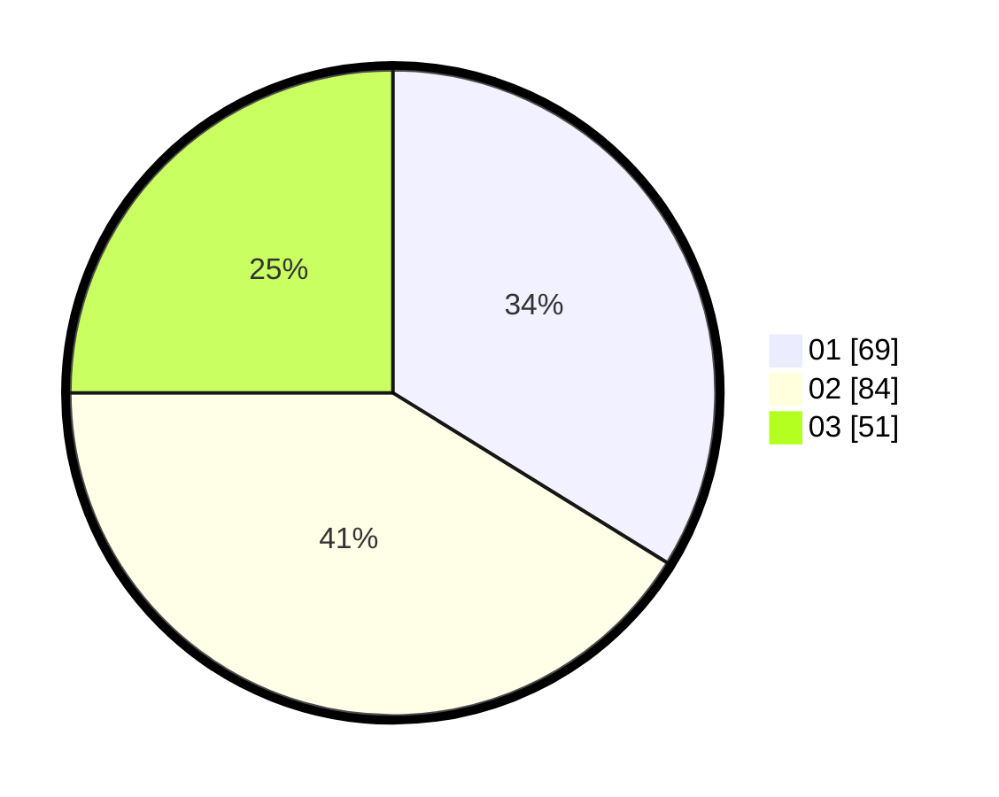

# Hasil

Hasil perolehan suara paslon dapat dilihat pada file paslon-01.txt, paslon-02.txt, dan paslon-03.txt.

Jika tidak ada, artinya data tersebut belum ada pada SIREKAP.

## Perolehan Suara

 * Paslon 01: **69**.
 * Paslon 02: **84**.
 * Paslon 03: **51**.

## Foto C Plano

https://sirekap-obj-formc.kpu.go.id/9b6a/pemilu/ppwp/31/73/05/10/05/3173051005059-20240214-184837--7f6a69b9-593d-472c-8c1d-4a7eab82508d.jpg

https://sirekap-obj-formc.kpu.go.id/9b6a/pemilu/ppwp/31/73/05/10/05/3173051005059-20240214-155539--6c1c61f8-ca81-4527-943d-25cffde48405.jpg

https://sirekap-obj-formc.kpu.go.id/9b6a/pemilu/ppwp/31/73/05/10/05/3173051005059-20240214-155556--3815fd2a-1036-4686-81e1-1fd7728d4296.jpg

## DATA PEMILIH TETAP

Jumlah pemilih dalam DPT: **412**.
 * L: **851**.
 * P: **441**.

## DATA PENGGUNA HAK PILIH

Jumlah pengguna hak pilih dalam DPT: **206**.
 * L: **108**.
 * P: **98**.

Jumlah pengguna hak pilih dalam DPTb: **0**.
 * L: **0**.
 * P: **0**.

Jumlah pengguna hak pilih dalam DPK: **0**.
 * L: **10**.
 * P: **10**.

Jumlah pengguna hak pilih: **820**.
 * L: **710**.
 * P: **909**.

## JUMLAH SUARA SAH DAN TIDAK SAH

JUMLAH SELURUH SUARA SAH: **204**.

JUMLAH SUARA TIDAK SAH: **3**.

JUMLAH SELURUH SUARA SAH DAN SUARA TIDAK SAH: **207**.
