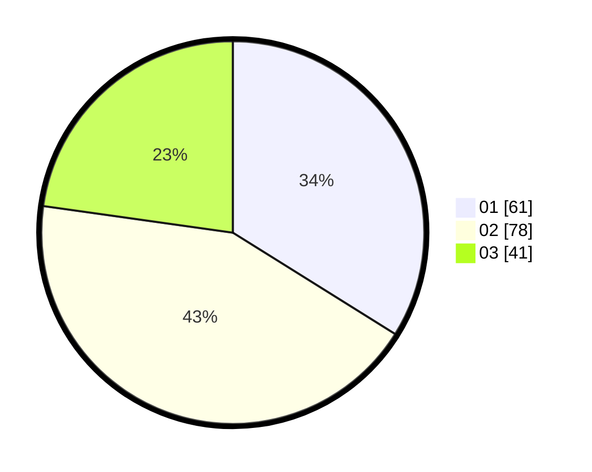

# Hasil

Hasil perolehan suara paslon dapat dilihat pada file paslon-01.txt, paslon-02.txt, dan paslon-03.txt.

Jika tidak ada, artinya data tersebut belum ada pada SIREKAP.

## Perolehan Suara

 * Paslon 01: **61**.
 * Paslon 02: **78**.
 * Paslon 03: **41**.

## Foto C Plano

https://sirekap-obj-formc.kpu.go.id/924b/pemilu/ppwp/31/73/05/10/05/3173051005068-20240214-202721--dbef8087-a3d3-4156-a097-8911d7f0437d.jpg

https://sirekap-obj-formc.kpu.go.id/924b/pemilu/ppwp/31/73/05/10/05/3173051005068-20240214-202815--c5f8d7cc-c59a-439c-88d2-70469b8283cd.jpg

https://sirekap-obj-formc.kpu.go.id/924b/pemilu/ppwp/31/73/05/10/05/3173051005068-20240214-203013--72cab8dd-3405-4932-8c87-b52e4a509919.jpg

## DATA PEMILIH TETAP

Jumlah pemilih dalam DPT: **248**.
 * L: **127**.
 * P: **121**.

## DATA PENGGUNA HAK PILIH

Jumlah pengguna hak pilih dalam DPT: **180**.
 * L: **86**.
 * P: **94**.

Jumlah pengguna hak pilih dalam DPTb: **0**.
 * L: **0**.
 * P: **0**.

Jumlah pengguna hak pilih dalam DPK: **2**.
 * L: **0**.
 * P: **2**.

Jumlah pengguna hak pilih: **182**.
 * L: **86**.
 * P: **96**.

## JUMLAH SUARA SAH DAN TIDAK SAH

JUMLAH SELURUH SUARA SAH: **180**.

JUMLAH SUARA TIDAK SAH: **2**.

JUMLAH SELURUH SUARA SAH DAN SUARA TIDAK SAH: **182**.
