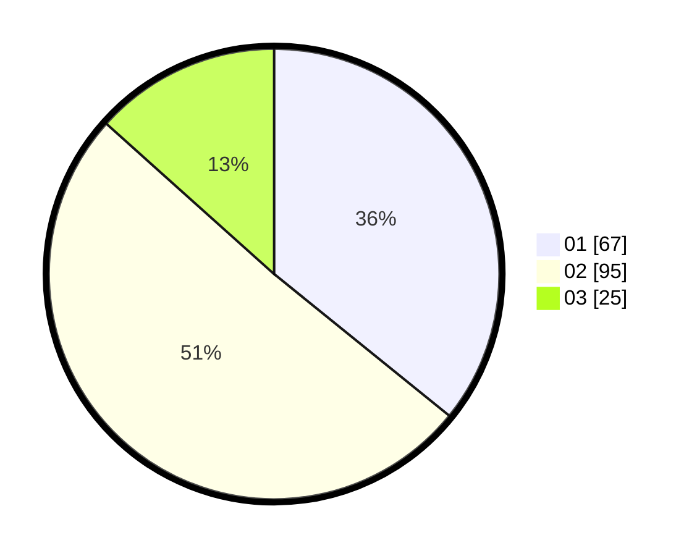

# Hasil

Hasil perolehan suara paslon dapat dilihat pada file paslon-01.txt, paslon-02.txt, dan paslon-03.txt.

Jika tidak ada, artinya data tersebut belum ada pada SIREKAP.

## Perolehan Suara

 * Paslon 01: **67**.
 * Paslon 02: **95**.
 * Paslon 03: **25**.

## Foto C Plano

https://sirekap-obj-formc.kpu.go.id/e3d4/pemilu/ppwp/31/73/05/10/05/3173051005069-20240214-192413--99a63d76-37a4-4b76-83b9-553d8b69f3fa.jpg

https://sirekap-obj-formc.kpu.go.id/e3d4/pemilu/ppwp/31/73/05/10/05/3173051005069-20240214-155424--147a2192-70f5-4d8b-b0f0-915094f255d5.jpg

https://sirekap-obj-formc.kpu.go.id/e3d4/pemilu/ppwp/31/73/05/10/05/3173051005069-20240215-220548--a62ba1b1-e417-4c78-8294-98083537e090.jpg

## DATA PEMILIH TETAP

Jumlah pemilih dalam DPT: **248**.
 * L: **117**.
 * P: **131**.

## DATA PENGGUNA HAK PILIH

Jumlah pengguna hak pilih dalam DPT: **188**.
 * L: **83**.
 * P: **105**.

Jumlah pengguna hak pilih dalam DPTb: **0**.
 * L: **0**.
 * P: **0**.

Jumlah pengguna hak pilih dalam DPK: **0**.
 * L: **0**.
 * P: **0**.

Jumlah pengguna hak pilih: **188**.
 * L: **83**.
 * P: **105**.

## JUMLAH SUARA SAH DAN TIDAK SAH

JUMLAH SELURUH SUARA SAH: **187**.

JUMLAH SUARA TIDAK SAH: **1**.

JUMLAH SELURUH SUARA SAH DAN SUARA TIDAK SAH: **188**.
