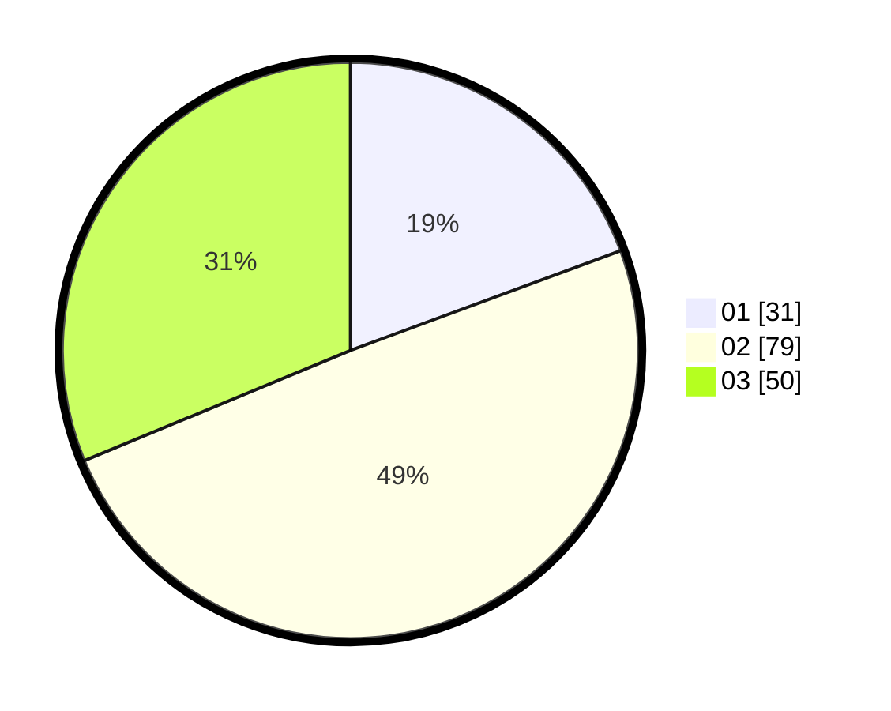

# Hasil

Hasil perolehan suara paslon dapat dilihat pada file paslon-01.txt, paslon-02.txt, dan paslon-03.txt.

Jika tidak ada, artinya data tersebut belum ada pada SIREKAP.

## Perolehan Suara

 * Paslon 01: **31**.
 * Paslon 02: **79**.
 * Paslon 03: **50**.

## Foto C Plano

https://sirekap-obj-formc.kpu.go.id/a6ff/pemilu/ppwp/31/73/05/10/05/3173051005073-20240215-033309--2870b500-3d99-47eb-85f0-ebc583519472.jpg

https://sirekap-obj-formc.kpu.go.id/a6ff/pemilu/ppwp/31/73/05/10/05/3173051005073-20240215-033318--a9e3c1f4-c617-46fe-9504-dd68fdf525e0.jpg

https://sirekap-obj-formc.kpu.go.id/a6ff/pemilu/ppwp/31/73/05/10/05/3173051005073-20240215-033325--16b91c2e-4518-4c96-a166-424de8230597.jpg
