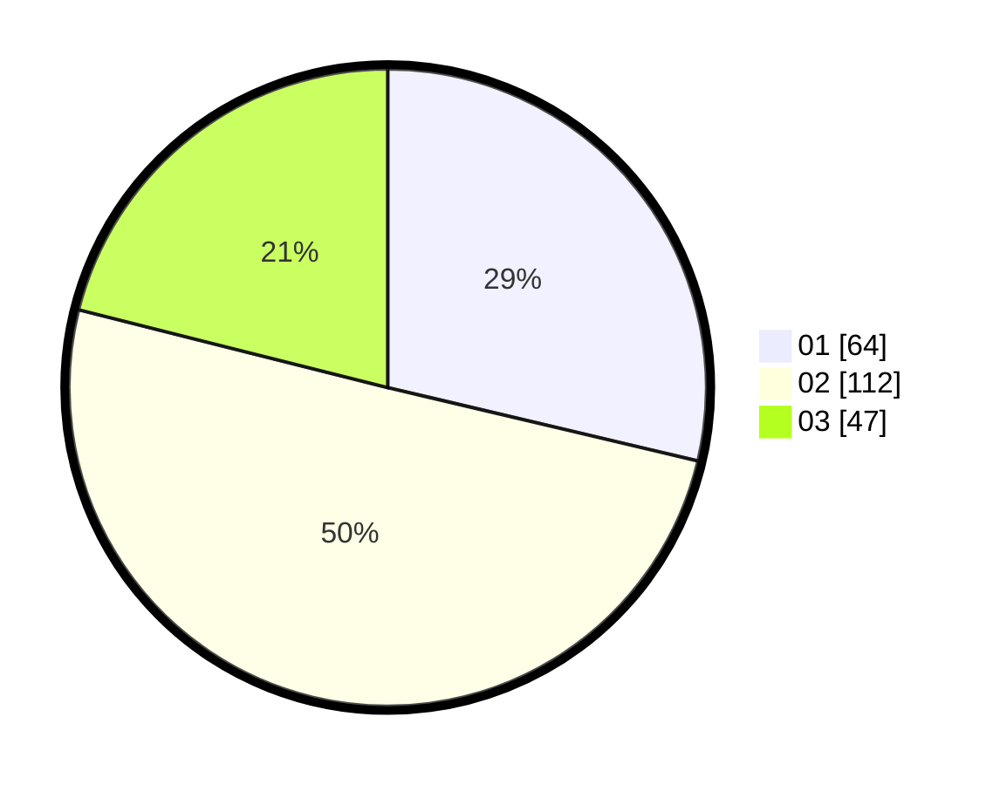

# Hasil

Hasil perolehan suara paslon dapat dilihat pada file paslon-01.txt, paslon-02.txt, dan paslon-03.txt.

Jika tidak ada, artinya data tersebut belum ada pada SIREKAP.

## Perolehan Suara

 * Paslon 01: **64**.
 * Paslon 02: **112**.
 * Paslon 03: **47**.

## Foto C Plano

https://sirekap-obj-formc.kpu.go.id/7d72/pemilu/ppwp/31/73/05/10/05/3173051005076-20240215-001003--012b9934-8a46-428a-9643-a2c7d354d01f.jpg

https://sirekap-obj-formc.kpu.go.id/7d72/pemilu/ppwp/31/73/05/10/05/3173051005076-20240214-202750--1b2af247-b4f5-4038-8bee-a14de7ab69d6.jpg

https://sirekap-obj-formc.kpu.go.id/7d72/pemilu/ppwp/31/73/05/10/05/3173051005076-20240215-015801--0e9ef096-de80-461d-8d5e-5386c4692bbe.jpg
