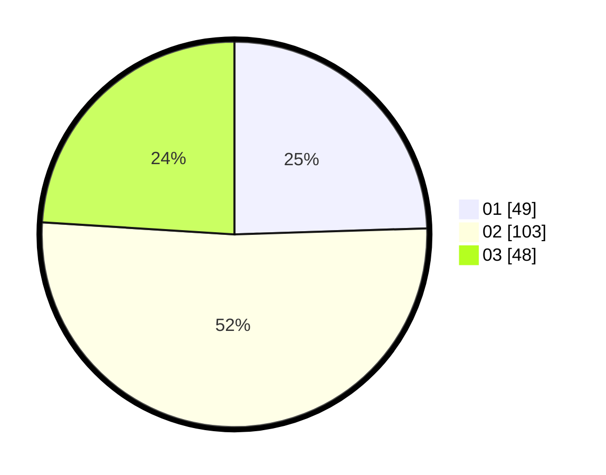

# Hasil

Hasil perolehan suara paslon dapat dilihat pada file paslon-01.txt, paslon-02.txt, dan paslon-03.txt.

Jika tidak ada, artinya data tersebut belum ada pada SIREKAP.

## Perolehan Suara

 * Paslon 01: **49**.
 * Paslon 02: **103**.
 * Paslon 03: **48**.

## Foto C Plano

https://sirekap-obj-formc.kpu.go.id/7274/pemilu/ppwp/31/73/05/10/05/3173051005077-20240214-215409--afef6140-3706-48eb-8388-cd6aa28a6fd9.jpg

https://sirekap-obj-formc.kpu.go.id/7274/pemilu/ppwp/31/73/05/10/05/3173051005077-20240214-215502--99bb35d0-642d-4a0f-82df-703cd39d1e58.jpg

https://sirekap-obj-formc.kpu.go.id/7274/pemilu/ppwp/31/73/05/10/05/3173051005077-20240214-215632--6f75ac98-88aa-4cba-b8bb-bd72ae0ff798.jpg
