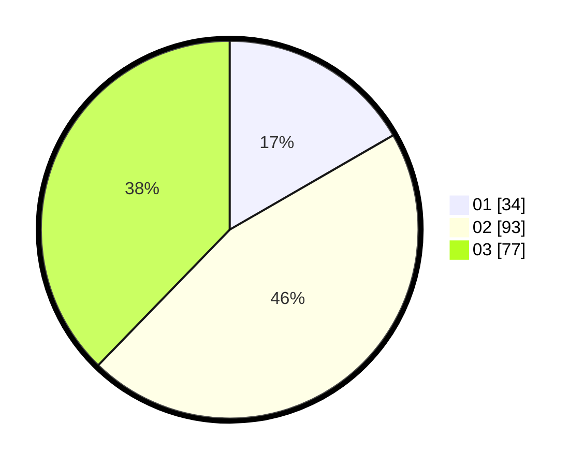

# Hasil

Hasil perolehan suara paslon dapat dilihat pada file paslon-01.txt, paslon-02.txt, dan paslon-03.txt.

Jika tidak ada, artinya data tersebut belum ada pada SIREKAP.

## Perolehan Suara

 * Paslon 01: **34**.
 * Paslon 02: **93**.
 * Paslon 03: **77**.

## Foto C Plano

https://sirekap-obj-formc.kpu.go.id/2e08/pemilu/ppwp/31/73/05/10/05/3173051005080-20240216-130722--1dc27187-3bfb-47d4-a68b-4f812a5d36ff.jpg

https://sirekap-obj-formc.kpu.go.id/2e08/pemilu/ppwp/31/73/05/10/05/3173051005080-20240216-132615--a74ff63a-3cb5-4f37-b56d-06d18c8f3faa.jpg

https://sirekap-obj-formc.kpu.go.id/2e08/pemilu/ppwp/31/73/05/10/05/3173051005080-20240216-133142--380b429e-0218-41b0-a80e-2060b783ff31.jpg

## DATA PEMILIH TETAP

Jumlah pemilih dalam DPT: **293**.
 * L: **141**.
 * P: **152**.

## DATA PENGGUNA HAK PILIH

Jumlah pengguna hak pilih dalam DPT: **202**.
 * L: **95**.
 * P: **107**.

Jumlah pengguna hak pilih dalam DPTb: **0**.
 * L: **0**.
 * P: **0**.

Jumlah pengguna hak pilih dalam DPK: **2**.
 * L: **0**.
 * P: **2**.

Jumlah pengguna hak pilih: **204**.
 * L: **95**.
 * P: **109**.

## JUMLAH SUARA SAH DAN TIDAK SAH

JUMLAH SELURUH SUARA SAH: **204**.

JUMLAH SUARA TIDAK SAH: **0**.

JUMLAH SELURUH SUARA SAH DAN SUARA TIDAK SAH: **204**.
