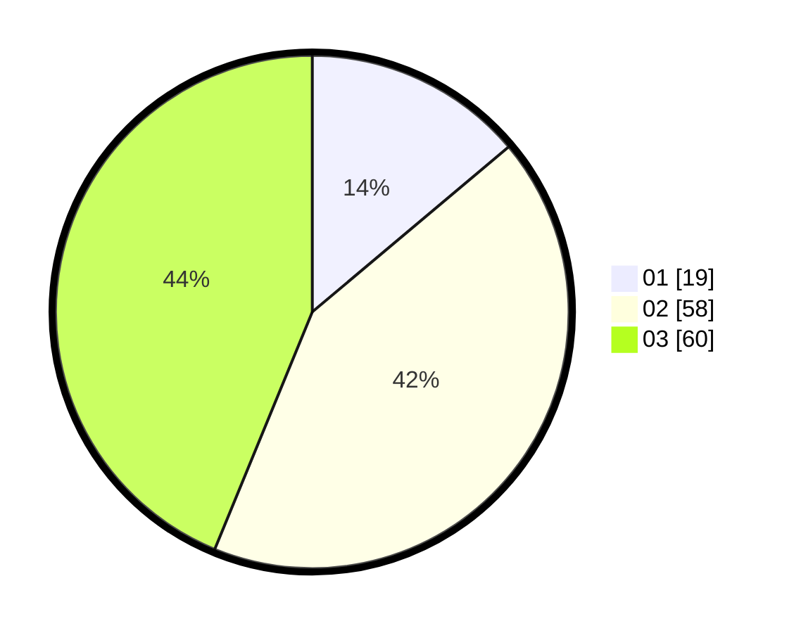

# Hasil

Hasil perolehan suara paslon dapat dilihat pada file paslon-01.txt, paslon-02.txt, dan paslon-03.txt.

Jika tidak ada, artinya data tersebut belum ada pada SIREKAP.

## Perolehan Suara

 * Paslon 01: **19**.
 * Paslon 02: **58**.
 * Paslon 03: **60**.

## Foto C Plano

https://sirekap-obj-formc.kpu.go.id/3f81/pemilu/ppwp/31/73/05/10/05/3173051005083-20240214-235734--ec4a7c53-70df-4849-9cfc-92c69375b3ba.jpg

https://sirekap-obj-formc.kpu.go.id/3f81/pemilu/ppwp/31/73/05/10/05/3173051005083-20240214-234100--4882996b-7271-48e1-82e6-55e6a6cde54f.jpg

https://sirekap-obj-formc.kpu.go.id/3f81/pemilu/ppwp/31/73/05/10/05/3173051005083-20240214-234406--579c1511-41af-46f7-a2b0-309f74c90b1f.jpg
