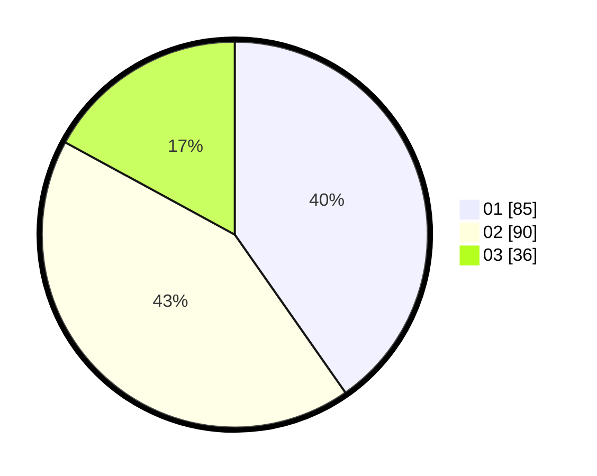

# Hasil

Hasil perolehan suara paslon dapat dilihat pada file paslon-01.txt, paslon-02.txt, dan paslon-03.txt.

Jika tidak ada, artinya data tersebut belum ada pada SIREKAP.

## Perolehan Suara

 * Paslon 01: **85**.
 * Paslon 02: **90**.
 * Paslon 03: **36**.

## Foto C Plano

https://sirekap-obj-formc.kpu.go.id/f1e5/pemilu/ppwp/31/73/05/10/05/3173051005089-20240214-235432--4c9b411e-f969-40eb-b76a-d7c8dd2fabf3.jpg

https://sirekap-obj-formc.kpu.go.id/f1e5/pemilu/ppwp/31/73/05/10/05/3173051005089-20240214-215712--0f60cb80-fa04-472c-bc2a-ac7a5d005857.jpg
