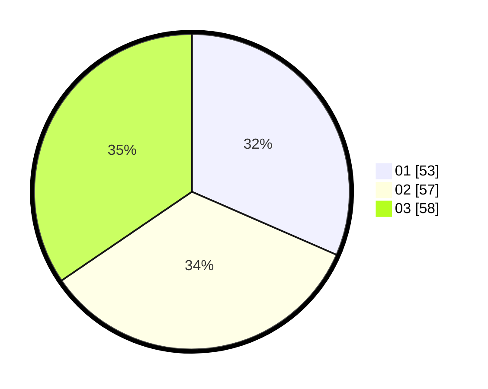

# Hasil

Hasil perolehan suara paslon dapat dilihat pada file paslon-01.txt, paslon-02.txt, dan paslon-03.txt.

Jika tidak ada, artinya data tersebut belum ada pada SIREKAP.

## Perolehan Suara

 * Paslon 01: **53**.
 * Paslon 02: **57**.
 * Paslon 03: **58**.

## Foto C Plano

https://sirekap-obj-formc.kpu.go.id/c725/pemilu/ppwp/31/73/05/10/05/3173051005090-20240214-194118--7c6075e7-c632-4387-923e-6dc85a811170.jpg

https://sirekap-obj-formc.kpu.go.id/c725/pemilu/ppwp/31/73/05/10/05/3173051005090-20240214-201632--344dc91a-e6cf-4d37-96ea-69c9764f5e73.jpg

https://sirekap-obj-formc.kpu.go.id/c725/pemilu/ppwp/31/73/05/10/05/3173051005090-20240214-194441--78c18bf6-41bb-43a6-b51e-1705490f2df0.jpg

## DATA PEMILIH TETAP

Jumlah pemilih dalam DPT: **243**.
 * L: **111**.
 * P: **132**.

## DATA PENGGUNA HAK PILIH

Jumlah pengguna hak pilih dalam DPT: **174**.
 * L: **81**.
 * P: **93**.

Jumlah pengguna hak pilih dalam DPTb: **0**.
 * L: **0**.
 * P: **0**.

Jumlah pengguna hak pilih dalam DPK: **0**.
 * L: **0**.
 * P: **0**.

Jumlah pengguna hak pilih: **174**.
 * L: **81**.
 * P: **93**.

## JUMLAH SUARA SAH DAN TIDAK SAH

JUMLAH SELURUH SUARA SAH: **168**.

JUMLAH SUARA TIDAK SAH: **6**.

JUMLAH SELURUH SUARA SAH DAN SUARA TIDAK SAH: **174**.
