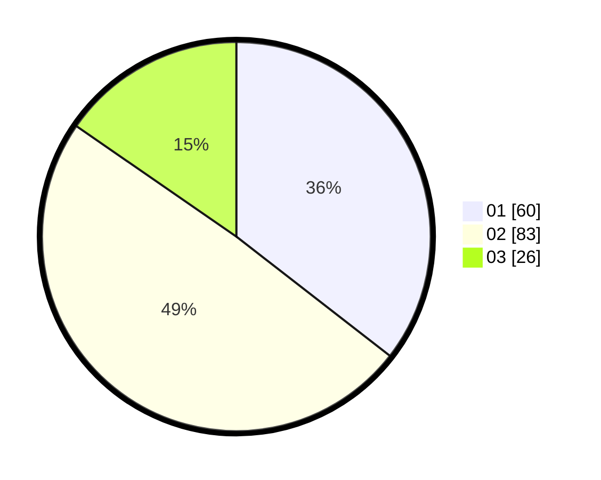

# Hasil

Hasil perolehan suara paslon dapat dilihat pada file paslon-01.txt, paslon-02.txt, dan paslon-03.txt.

Jika tidak ada, artinya data tersebut belum ada pada SIREKAP.

## Perolehan Suara

 * Paslon 01: **60**.
 * Paslon 02: **83**.
 * Paslon 03: **26**.

## Foto C Plano

https://sirekap-obj-formc.kpu.go.id/f2af/pemilu/ppwp/31/73/05/10/05/3173051005091-20240214-193048--6e5fce63-5f33-44c7-97ce-fa72ec74a004.jpg

https://sirekap-obj-formc.kpu.go.id/f2af/pemilu/ppwp/31/73/05/10/05/3173051005091-20240214-193126--6b1097f8-d240-40e5-bbb6-2c14ff9d3219.jpg

https://sirekap-obj-formc.kpu.go.id/f2af/pemilu/ppwp/31/73/05/10/05/3173051005091-20240214-193201--e2d22ba1-8dcb-4232-a9a4-77b68b5124b5.jpg

## DATA PEMILIH TETAP

Jumlah pemilih dalam DPT: **228**.
 * L: **117**.
 * P: **111**.

## DATA PENGGUNA HAK PILIH

Jumlah pengguna hak pilih dalam DPT: **168**.
 * L: **86**.
 * P: **82**.

Jumlah pengguna hak pilih dalam DPTb: **0**.
 * L: **0**.
 * P: **0**.

Jumlah pengguna hak pilih dalam DPK: **3**.
 * L: **2**.
 * P: **1**.

Jumlah pengguna hak pilih: **171**.
 * L: **88**.
 * P: **83**.

## JUMLAH SUARA SAH DAN TIDAK SAH

JUMLAH SELURUH SUARA SAH: **169**.

JUMLAH SUARA TIDAK SAH: **2**.

JUMLAH SELURUH SUARA SAH DAN SUARA TIDAK SAH: **171**.
