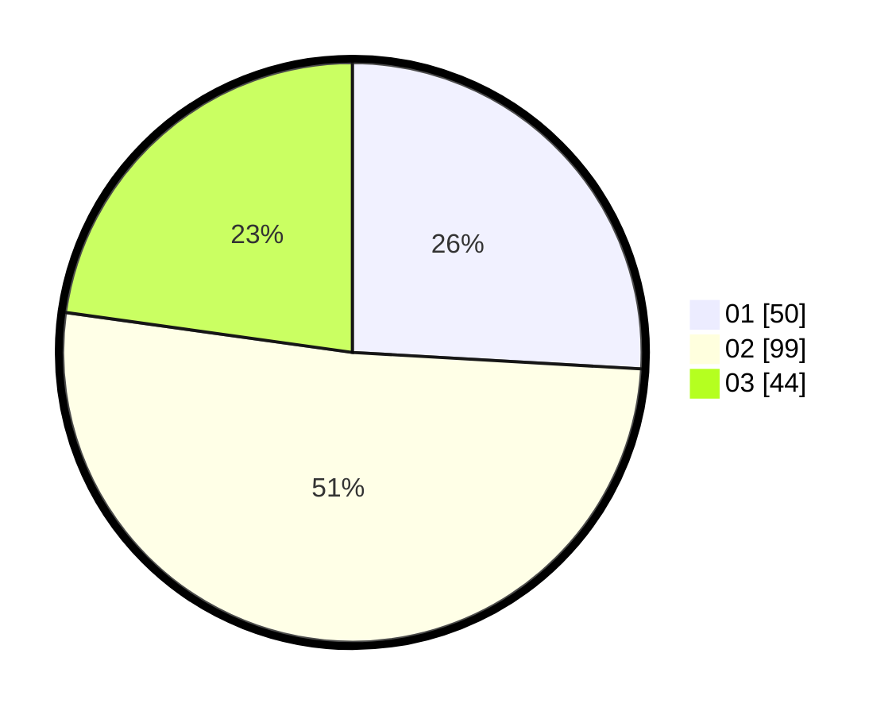

# Hasil

Hasil perolehan suara paslon dapat dilihat pada file paslon-01.txt, paslon-02.txt, dan paslon-03.txt.

Jika tidak ada, artinya data tersebut belum ada pada SIREKAP.

## Perolehan Suara

 * Paslon 01: **50**.
 * Paslon 02: **99**.
 * Paslon 03: **44**.

## Foto C Plano

https://sirekap-obj-formc.kpu.go.id/4781/pemilu/ppwp/31/73/05/10/05/3173051005093-20240214-185627--052ed24a-2daa-4a98-9dec-ef2008202ae9.jpg

https://sirekap-obj-formc.kpu.go.id/4781/pemilu/ppwp/31/73/05/10/05/3173051005093-20240214-185421--e6b1dd28-7854-4ec9-9772-314af419cd8f.jpg

https://sirekap-obj-formc.kpu.go.id/4781/pemilu/ppwp/31/73/05/10/05/3173051005093-20240214-185435--e6d39490-d337-49fa-9ce5-379ae0a91cad.jpg

## DATA PEMILIH TETAP

Jumlah pemilih dalam DPT: **274**.
 * L: **132**.
 * P: **142**.

## DATA PENGGUNA HAK PILIH

Jumlah pengguna hak pilih dalam DPT: **190**.
 * L: **91**.
 * P: **99**.

Jumlah pengguna hak pilih dalam DPTb: **0**.
 * L: **0**.
 * P: **0**.

Jumlah pengguna hak pilih dalam DPK: **7**.
 * L: **4**.
 * P: **3**.

Jumlah pengguna hak pilih: **197**.
 * L: **95**.
 * P: **102**.

## JUMLAH SUARA SAH DAN TIDAK SAH

JUMLAH SELURUH SUARA SAH: **193**.

JUMLAH SUARA TIDAK SAH: **4**.

JUMLAH SELURUH SUARA SAH DAN SUARA TIDAK SAH: **197**.
