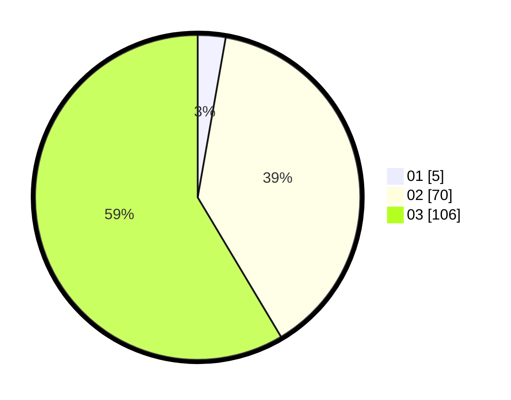

# Hasil

Hasil perolehan suara paslon dapat dilihat pada file paslon-01.txt, paslon-02.txt, dan paslon-03.txt.

Jika tidak ada, artinya data tersebut belum ada pada SIREKAP.

## Perolehan Suara

 * Paslon 01: **5**.
 * Paslon 02: **70**.
 * Paslon 03: **106**.

## Foto C Plano

https://sirekap-obj-formc.kpu.go.id/c354/pemilu/ppwp/31/73/05/10/05/3173051005097-20240214-230300--c00bfd7b-5bf8-4697-9581-4e93506f938e.jpg

https://sirekap-obj-formc.kpu.go.id/c354/pemilu/ppwp/31/73/05/10/05/3173051005097-20240214-230405--1dfa8fa3-3164-43fb-b8cc-1171b67c1f70.jpg

https://sirekap-obj-formc.kpu.go.id/c354/pemilu/ppwp/31/73/05/10/05/3173051005097-20240214-230409--8111dc42-c3fe-4c7d-a806-f538f60b4aa1.jpg

## DATA PEMILIH TETAP

Jumlah pemilih dalam DPT: **233**.
 * L: **103**.
 * P: **130**.

## DATA PENGGUNA HAK PILIH

Jumlah pengguna hak pilih dalam DPT: **182**.
 * L: **81**.
 * P: **101**.

Jumlah pengguna hak pilih dalam DPTb: **0**.
 * L: **0**.
 * P: **0**.

Jumlah pengguna hak pilih dalam DPK: **2**.
 * L: **1**.
 * P: **1**.

Jumlah pengguna hak pilih: **184**.
 * L: **82**.
 * P: **102**.

## JUMLAH SUARA SAH DAN TIDAK SAH

JUMLAH SELURUH SUARA SAH: **181**.

JUMLAH SUARA TIDAK SAH: **3**.

JUMLAH SELURUH SUARA SAH DAN SUARA TIDAK SAH: **184**.
