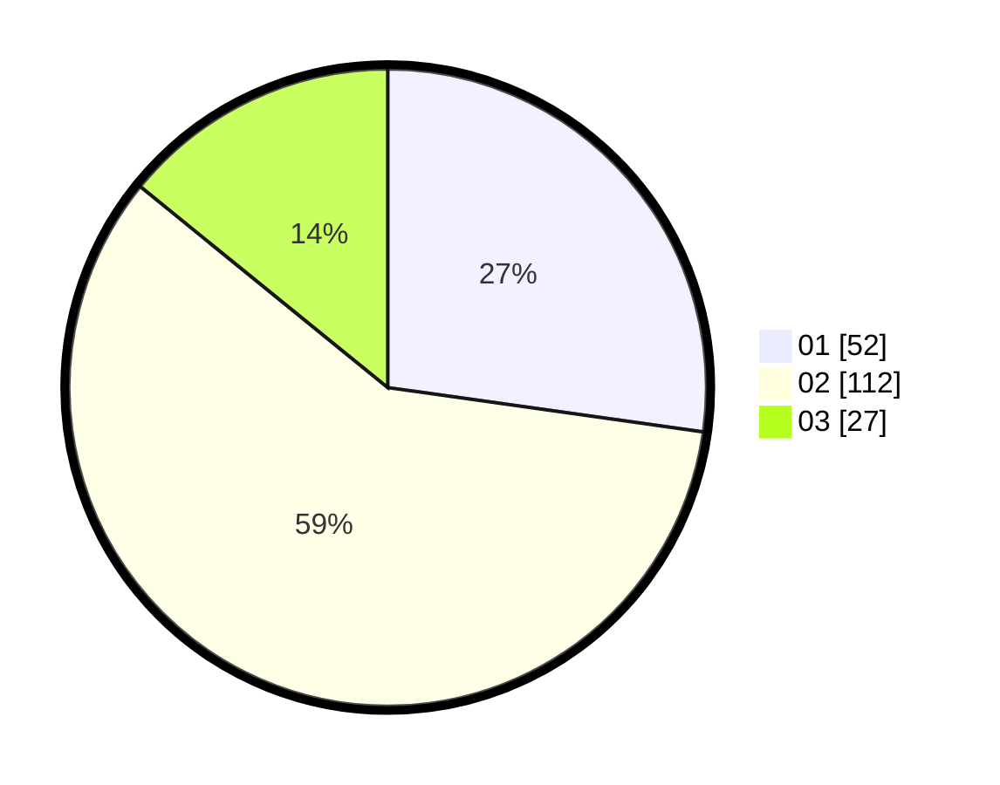

# Hasil

Hasil perolehan suara paslon dapat dilihat pada file paslon-01.txt, paslon-02.txt, dan paslon-03.txt.

Jika tidak ada, artinya data tersebut belum ada pada SIREKAP.

## Perolehan Suara

 * Paslon 01: **52**.
 * Paslon 02: **112**.
 * Paslon 03: **27**.

## Foto C Plano

https://sirekap-obj-formc.kpu.go.id/f792/pemilu/ppwp/31/73/05/10/05/3173051005098-20240214-201856--46879861-12f9-4bb8-b2b5-0debadfe7552.jpg

https://sirekap-obj-formc.kpu.go.id/f792/pemilu/ppwp/31/73/05/10/05/3173051005098-20240214-201900--2417a18d-757b-471f-9531-c41b02c2707c.jpg

https://sirekap-obj-formc.kpu.go.id/f792/pemilu/ppwp/31/73/05/10/05/3173051005098-20240214-201903--55611ae0-6e0f-41cb-9bb0-ee57a72b3712.jpg
