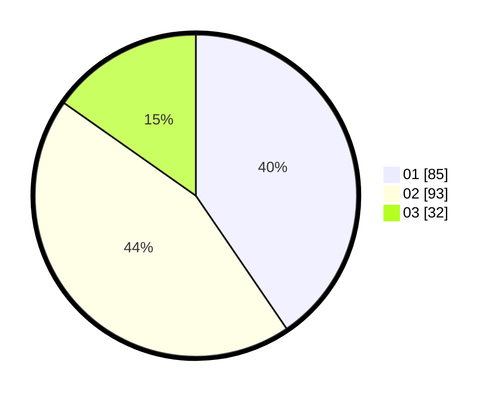

# Hasil

Hasil perolehan suara paslon dapat dilihat pada file paslon-01.txt, paslon-02.txt, dan paslon-03.txt.

Jika tidak ada, artinya data tersebut belum ada pada SIREKAP.

## Perolehan Suara

 * Paslon 01: **85**.
 * Paslon 02: **93**.
 * Paslon 03: **32**.

## Foto C Plano

https://sirekap-obj-formc.kpu.go.id/8de7/pemilu/ppwp/31/73/05/10/05/3173051005100-20240214-220956--d4529cdd-2f1f-4f55-9741-e56679a63716.jpg

https://sirekap-obj-formc.kpu.go.id/8de7/pemilu/ppwp/31/73/05/10/05/3173051005100-20240214-221050--6f69eef8-fef0-4d40-8e7a-faa24564143b.jpg

https://sirekap-obj-formc.kpu.go.id/8de7/pemilu/ppwp/31/73/05/10/05/3173051005100-20240214-221213--a6c62493-0079-4d89-b0e2-f808a3583e02.jpg
