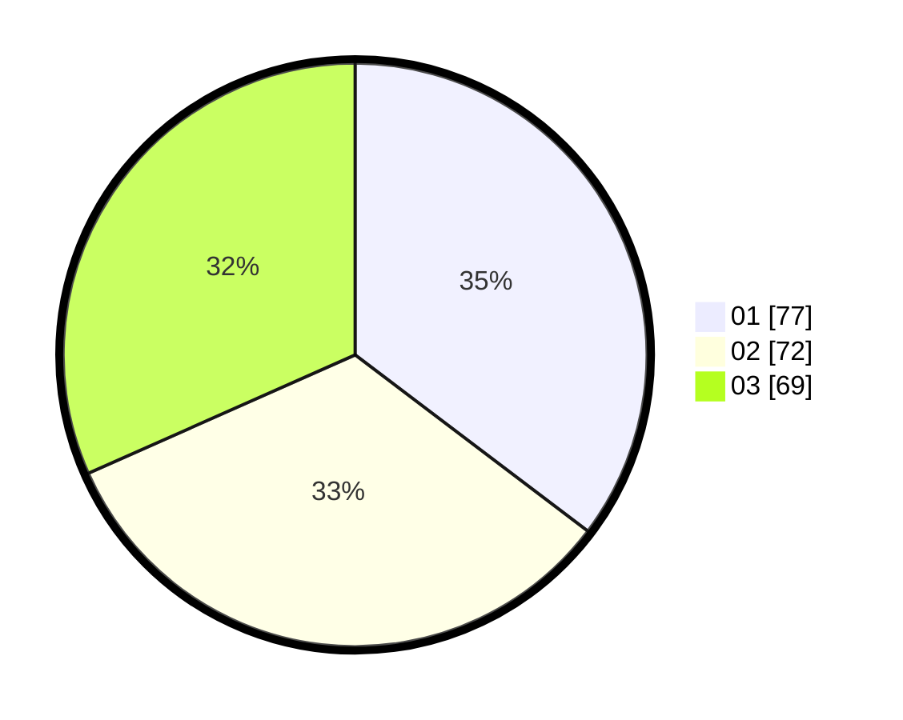

# Hasil

Hasil perolehan suara paslon dapat dilihat pada file paslon-01.txt, paslon-02.txt, dan paslon-03.txt.

Jika tidak ada, artinya data tersebut belum ada pada SIREKAP.

## Perolehan Suara

 * Paslon 01: **77**.
 * Paslon 02: **72**.
 * Paslon 03: **69**.

## Foto C Plano

https://sirekap-obj-formc.kpu.go.id/4e4d/pemilu/ppwp/31/73/05/10/05/3173051005102-20240214-224708--5232b835-e4b2-4b5f-8d04-77bccf000e19.jpg

https://sirekap-obj-formc.kpu.go.id/4e4d/pemilu/ppwp/31/73/05/10/05/3173051005102-20240214-225308--7bc0a327-43da-49a5-8904-8ae53679a4af.jpg

https://sirekap-obj-formc.kpu.go.id/4e4d/pemilu/ppwp/31/73/05/10/05/3173051005102-20240214-225350--1ced686a-6ca2-446d-8e08-e6539a488047.jpg

## DATA PEMILIH TETAP

Jumlah pemilih dalam DPT: **277**.
 * L: **126**.
 * P: **151**.

## DATA PENGGUNA HAK PILIH

Jumlah pengguna hak pilih dalam DPT: **213**.
 * L: **95**.
 * P: **118**.

Jumlah pengguna hak pilih dalam DPTb: **6**.
 * L: **5**.
 * P: **1**.

Jumlah pengguna hak pilih dalam DPK: **1**.
 * L: **0**.
 * P: **1**.

Jumlah pengguna hak pilih: **220**.
 * L: **100**.
 * P: **120**.

## JUMLAH SUARA SAH DAN TIDAK SAH

JUMLAH SELURUH SUARA SAH: **218**.

JUMLAH SUARA TIDAK SAH: **2**.

JUMLAH SELURUH SUARA SAH DAN SUARA TIDAK SAH: **220**.
