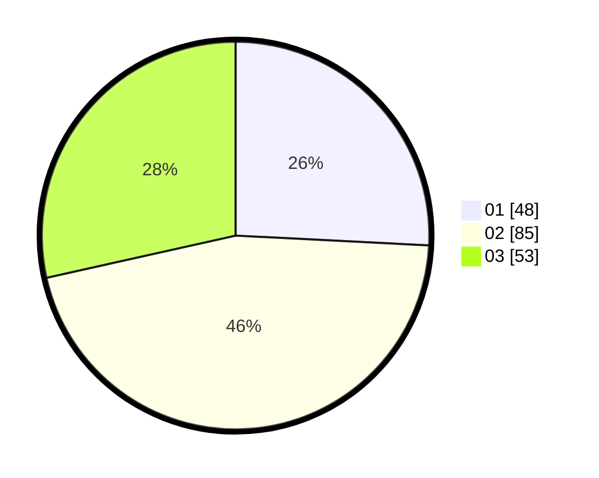

# Hasil

Hasil perolehan suara paslon dapat dilihat pada file paslon-01.txt, paslon-02.txt, dan paslon-03.txt.

Jika tidak ada, artinya data tersebut belum ada pada SIREKAP.

## Perolehan Suara

 * Paslon 01: **48**.
 * Paslon 02: **85**.
 * Paslon 03: **53**.

## Foto C Plano

https://sirekap-obj-formc.kpu.go.id/3e36/pemilu/ppwp/31/73/05/10/05/3173051005103-20240214-190526--dab67693-4d4e-4753-8069-135f3c279293.jpg

https://sirekap-obj-formc.kpu.go.id/3e36/pemilu/ppwp/31/73/05/10/05/3173051005103-20240214-190535--6b4b1d41-7f12-408a-8866-9ccd7b7b64da.jpg

https://sirekap-obj-formc.kpu.go.id/3e36/pemilu/ppwp/31/73/05/10/05/3173051005103-20240214-190543--58702ca1-ce84-43e7-8118-6f8c63455996.jpg

## DATA PEMILIH TETAP

Jumlah pemilih dalam DPT: **280**.
 * L: **137**.
 * P: **143**.

## DATA PENGGUNA HAK PILIH

Jumlah pengguna hak pilih dalam DPT: **180**.
 * L: **82**.
 * P: **98**.

Jumlah pengguna hak pilih dalam DPTb: **6**.
 * L: **4**.
 * P: **2**.

Jumlah pengguna hak pilih dalam DPK: **4**.
 * L: **3**.
 * P: **1**.

Jumlah pengguna hak pilih: **190**.
 * L: **89**.
 * P: **101**.

## JUMLAH SUARA SAH DAN TIDAK SAH

JUMLAH SELURUH SUARA SAH: **186**.

JUMLAH SUARA TIDAK SAH: **4**.

JUMLAH SELURUH SUARA SAH DAN SUARA TIDAK SAH: **190**.
