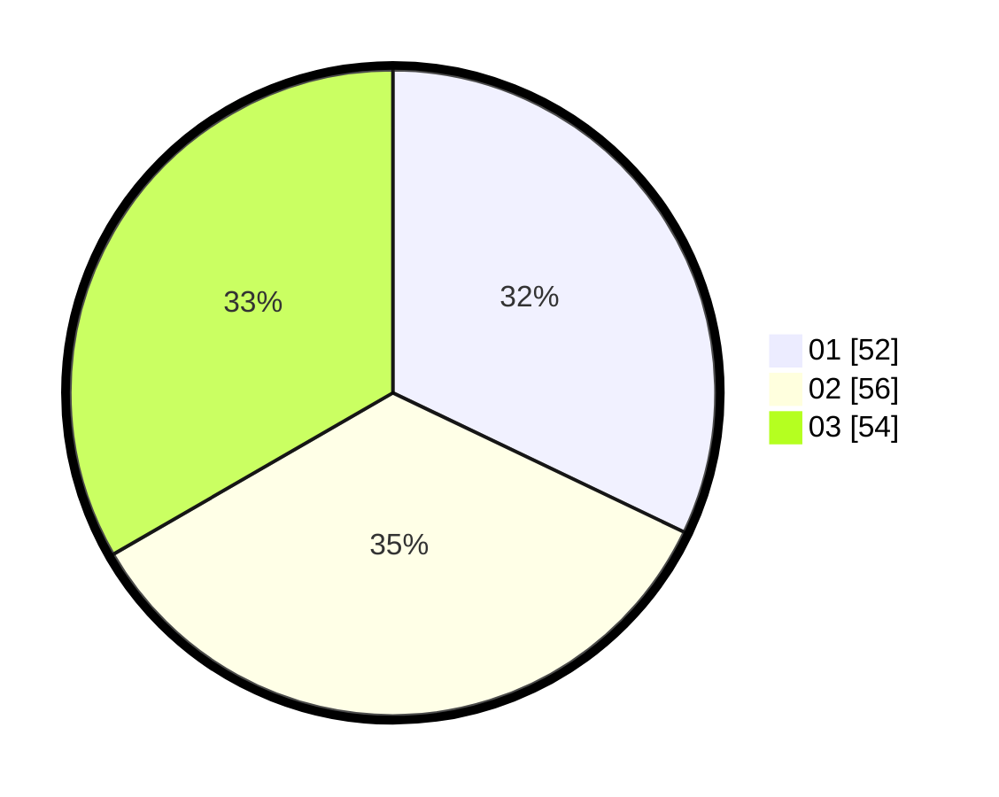

# Hasil

Hasil perolehan suara paslon dapat dilihat pada file paslon-01.txt, paslon-02.txt, dan paslon-03.txt.

Jika tidak ada, artinya data tersebut belum ada pada SIREKAP.

## Perolehan Suara

 * Paslon 01: **52**.
 * Paslon 02: **56**.
 * Paslon 03: **54**.

## Foto C Plano

https://sirekap-obj-formc.kpu.go.id/c36d/pemilu/ppwp/31/73/05/10/05/3173051005105-20240214-155251--5ecce475-e056-4c75-a1b9-cf187edae96a.jpg

https://sirekap-obj-formc.kpu.go.id/c36d/pemilu/ppwp/31/73/05/10/05/3173051005105-20240214-155254--6d616586-0fa8-4ef2-b851-bea4fffcdb0d.jpg

https://sirekap-obj-formc.kpu.go.id/c36d/pemilu/ppwp/31/73/05/10/05/3173051005105-20240214-155258--8b74fcd2-c06d-4428-a4f1-706249b08bca.jpg

## DATA PEMILIH TETAP

Jumlah pemilih dalam DPT: **212**.
 * L: **100**.
 * P: **112**.

## DATA PENGGUNA HAK PILIH

Jumlah pengguna hak pilih dalam DPT: **157**.
 * L: **73**.
 * P: **84**.

Jumlah pengguna hak pilih dalam DPTb: **5**.
 * L: **0**.
 * P: **5**.

Jumlah pengguna hak pilih dalam DPK: **2**.
 * L: **1**.
 * P: **1**.

Jumlah pengguna hak pilih: **164**.
 * L: **74**.
 * P: **90**.

## JUMLAH SUARA SAH DAN TIDAK SAH

JUMLAH SELURUH SUARA SAH: **162**.

JUMLAH SUARA TIDAK SAH: **2**.

JUMLAH SELURUH SUARA SAH DAN SUARA TIDAK SAH: **164**.
