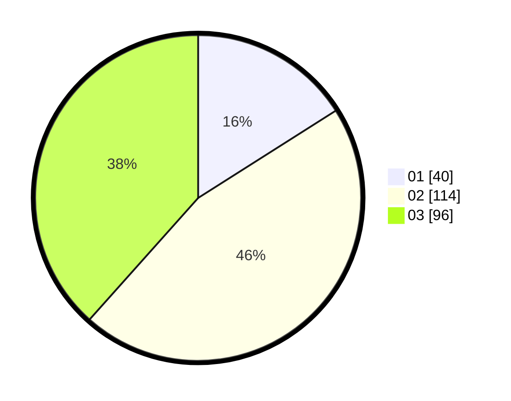

# Hasil

Hasil perolehan suara paslon dapat dilihat pada file paslon-01.txt, paslon-02.txt, dan paslon-03.txt.

Jika tidak ada, artinya data tersebut belum ada pada SIREKAP.

## Perolehan Suara

 * Paslon 01: **40**.
 * Paslon 02: **114**.
 * Paslon 03: **96**.

## Foto C Plano

https://sirekap-obj-formc.kpu.go.id/948b/pemilu/ppwp/31/73/05/10/05/3173051005108-20240214-212140--5061cbea-a18f-47e0-a8af-c625f9274190.jpg

https://sirekap-obj-formc.kpu.go.id/948b/pemilu/ppwp/31/73/05/10/05/3173051005108-20240214-212218--e974bebc-e840-4f8c-96ea-a39db7ad6fbb.jpg

https://sirekap-obj-formc.kpu.go.id/948b/pemilu/ppwp/31/73/05/10/05/3173051005108-20240214-212313--68316925-4e45-4477-a54b-a8ee4f2e2d4b.jpg

## DATA PEMILIH TETAP

Jumlah pemilih dalam DPT: **296**.
 * L: **134**.
 * P: **162**.

## DATA PENGGUNA HAK PILIH

Jumlah pengguna hak pilih dalam DPT: **235**.
 * L: **106**.
 * P: **129**.

Jumlah pengguna hak pilih dalam DPTb: **13**.
 * L: **6**.
 * P: **7**.

Jumlah pengguna hak pilih dalam DPK: **8**.
 * L: **1**.
 * P: **7**.

Jumlah pengguna hak pilih: **256**.
 * L: **113**.
 * P: **143**.

## JUMLAH SUARA SAH DAN TIDAK SAH

JUMLAH SELURUH SUARA SAH: **250**.

JUMLAH SUARA TIDAK SAH: **6**.

JUMLAH SELURUH SUARA SAH DAN SUARA TIDAK SAH: **256**.
