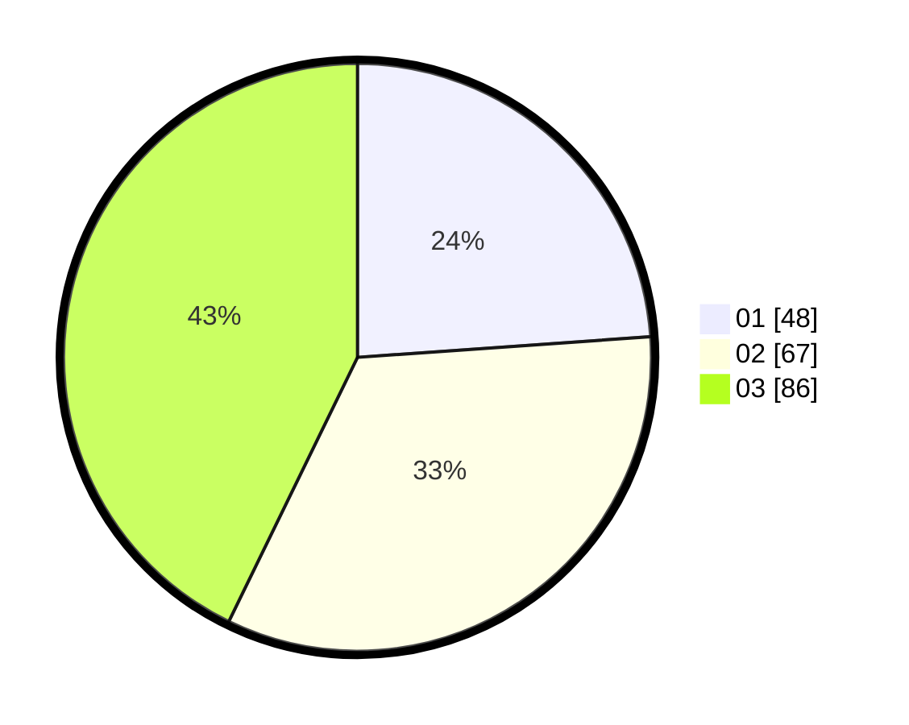

# Hasil

Hasil perolehan suara paslon dapat dilihat pada file paslon-01.txt, paslon-02.txt, dan paslon-03.txt.

Jika tidak ada, artinya data tersebut belum ada pada SIREKAP.

## Perolehan Suara

 * Paslon 01: **48**.
 * Paslon 02: **67**.
 * Paslon 03: **86**.

## Foto C Plano

https://sirekap-obj-formc.kpu.go.id/ce88/pemilu/ppwp/31/73/05/10/05/3173051005109-20240214-210726--a4ea559d-9593-4771-9c90-ecfc3bb6ac58.jpg

https://sirekap-obj-formc.kpu.go.id/ce88/pemilu/ppwp/31/73/05/10/05/3173051005109-20240214-210949--19172db2-98bc-40fe-8c09-dc1e8667cdb0.jpg

https://sirekap-obj-formc.kpu.go.id/ce88/pemilu/ppwp/31/73/05/10/05/3173051005109-20240214-211050--2a6b855f-3a7c-461b-941a-371eb777ed23.jpg

## DATA PEMILIH TETAP

Jumlah pemilih dalam DPT: **274**.
 * L: **128**.
 * P: **146**.

## DATA PENGGUNA HAK PILIH

Jumlah pengguna hak pilih dalam DPT: **199**.
 * L: **88**.
 * P: **111**.

Jumlah pengguna hak pilih dalam DPTb: **3**.
 * L: **1**.
 * P: **2**.

Jumlah pengguna hak pilih dalam DPK: **3**.
 * L: **2**.
 * P: **1**.

Jumlah pengguna hak pilih: **205**.
 * L: **91**.
 * P: **114**.

## JUMLAH SUARA SAH DAN TIDAK SAH

JUMLAH SELURUH SUARA SAH: **201**.

JUMLAH SUARA TIDAK SAH: **4**.

JUMLAH SELURUH SUARA SAH DAN SUARA TIDAK SAH: **205**.
