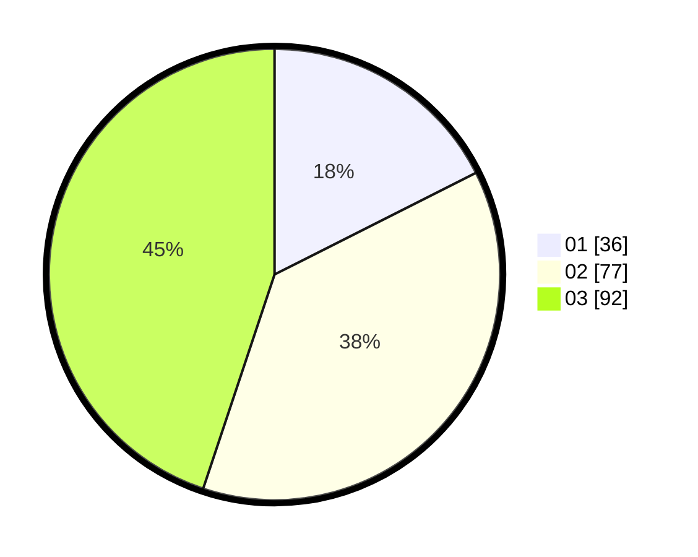

# Hasil

Hasil perolehan suara paslon dapat dilihat pada file paslon-01.txt, paslon-02.txt, dan paslon-03.txt.

Jika tidak ada, artinya data tersebut belum ada pada SIREKAP.

## Perolehan Suara

 * Paslon 01: **36**.
 * Paslon 02: **77**.
 * Paslon 03: **92**.

## Foto C Plano

https://sirekap-obj-formc.kpu.go.id/3552/pemilu/ppwp/31/73/05/10/05/3173051005111-20240214-190526--f0767a9a-05af-4190-8016-91770f88c24a.jpg

https://sirekap-obj-formc.kpu.go.id/3552/pemilu/ppwp/31/73/05/10/05/3173051005111-20240214-190752--7b5c9c70-7537-441e-aa40-10327de86e08.jpg

https://sirekap-obj-formc.kpu.go.id/3552/pemilu/ppwp/31/73/05/10/05/3173051005111-20240214-191022--6cc056ec-9483-4cfc-b08e-dc1bccd2d32b.jpg

## DATA PEMILIH TETAP

Jumlah pemilih dalam DPT: **282**.
 * L: **134**.
 * P: **148**.

## DATA PENGGUNA HAK PILIH

Jumlah pengguna hak pilih dalam DPT: **213**.
 * L: **100**.
 * P: **113**.

Jumlah pengguna hak pilih dalam DPTb: **0**.
 * L: **0**.
 * P: **0**.

Jumlah pengguna hak pilih dalam DPK: **3**.
 * L: **2**.
 * P: **1**.

Jumlah pengguna hak pilih: **216**.
 * L: **102**.
 * P: **114**.

## JUMLAH SUARA SAH DAN TIDAK SAH

JUMLAH SELURUH SUARA SAH: **205**.

JUMLAH SUARA TIDAK SAH: **11**.

JUMLAH SELURUH SUARA SAH DAN SUARA TIDAK SAH: **216**.
