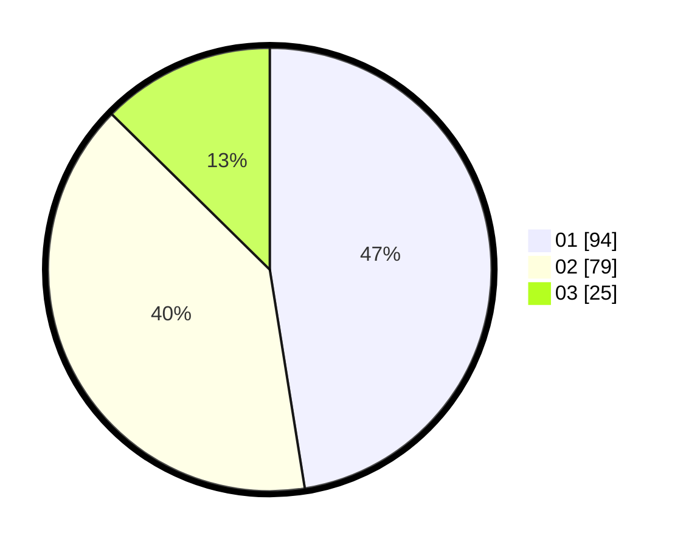

# Hasil

Hasil perolehan suara paslon dapat dilihat pada file paslon-01.txt, paslon-02.txt, dan paslon-03.txt.

Jika tidak ada, artinya data tersebut belum ada pada SIREKAP.

## Perolehan Suara

 * Paslon 01: **94**.
 * Paslon 02: **79**.
 * Paslon 03: **25**.

## Foto C Plano

https://sirekap-obj-formc.kpu.go.id/7c61/pemilu/ppwp/31/73/05/10/05/3173051005115-20240214-214246--79284e45-c22a-430c-90a1-ed9f66601576.jpg

https://sirekap-obj-formc.kpu.go.id/7c61/pemilu/ppwp/31/73/05/10/05/3173051005115-20240214-214420--7acba06e-d321-424f-8c2f-d9ceeb7f38f1.jpg

https://sirekap-obj-formc.kpu.go.id/7c61/pemilu/ppwp/31/73/05/10/05/3173051005115-20240214-214530--73ed454f-e500-4428-bc1a-86a86cb778c7.jpg
