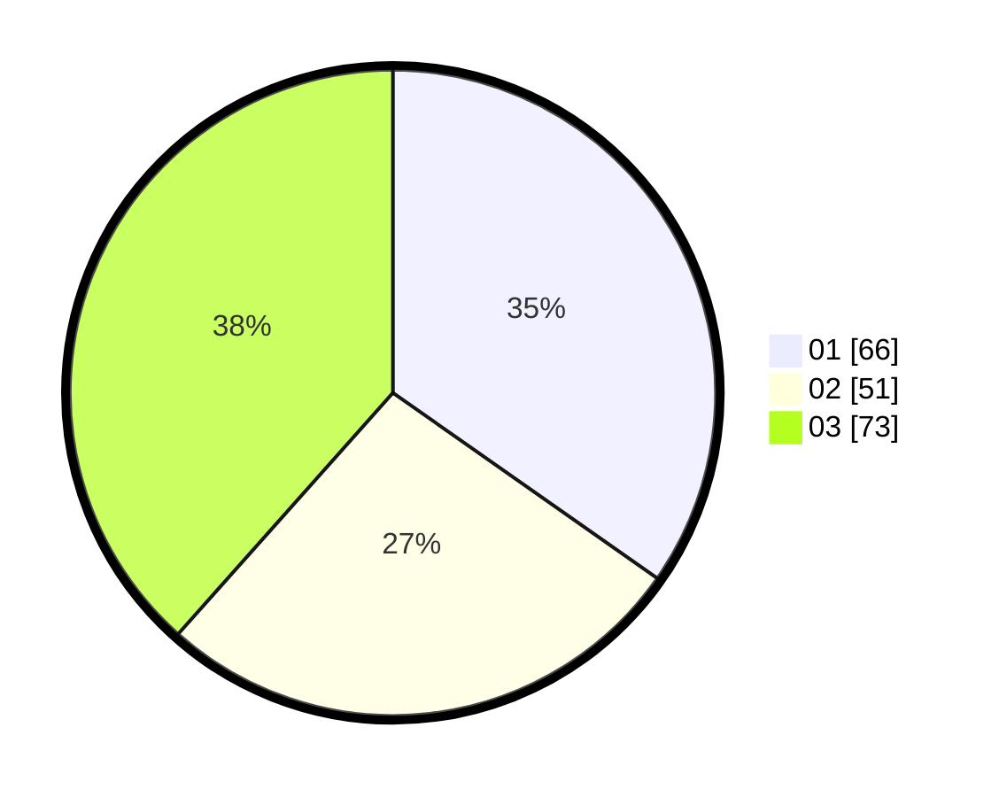

# Hasil

Hasil perolehan suara paslon dapat dilihat pada file paslon-01.txt, paslon-02.txt, dan paslon-03.txt.

Jika tidak ada, artinya data tersebut belum ada pada SIREKAP.

## Perolehan Suara

 * Paslon 01: **66**.
 * Paslon 02: **51**.
 * Paslon 03: **73**.

## Foto C Plano

https://sirekap-obj-formc.kpu.go.id/ab29/pemilu/ppwp/31/73/05/10/05/3173051005118-20240214-225148--7162d86e-b9e5-437b-bcb6-dd440f4243a1.jpg

https://sirekap-obj-formc.kpu.go.id/ab29/pemilu/ppwp/31/73/05/10/05/3173051005118-20240214-225447--8a842ef3-8d41-46af-b278-d453bdd7ba78.jpg

https://sirekap-obj-formc.kpu.go.id/ab29/pemilu/ppwp/31/73/05/10/05/3173051005118-20240214-225614--814a8982-344f-4656-a289-e29cfe955642.jpg

## DATA PEMILIH TETAP

Jumlah pemilih dalam DPT: **227**.
 * L: **110**.
 * P: **117**.

## DATA PENGGUNA HAK PILIH

Jumlah pengguna hak pilih dalam DPT: **189**.
 * L: **93**.
 * P: **96**.

Jumlah pengguna hak pilih dalam DPTb: **2**.
 * L: **0**.
 * P: **2**.

Jumlah pengguna hak pilih dalam DPK: **3**.
 * L: **2**.
 * P: **1**.

Jumlah pengguna hak pilih: **194**.
 * L: **95**.
 * P: **99**.

## JUMLAH SUARA SAH DAN TIDAK SAH

JUMLAH SELURUH SUARA SAH: **190**.

JUMLAH SUARA TIDAK SAH: **4**.

JUMLAH SELURUH SUARA SAH DAN SUARA TIDAK SAH: **194**.
