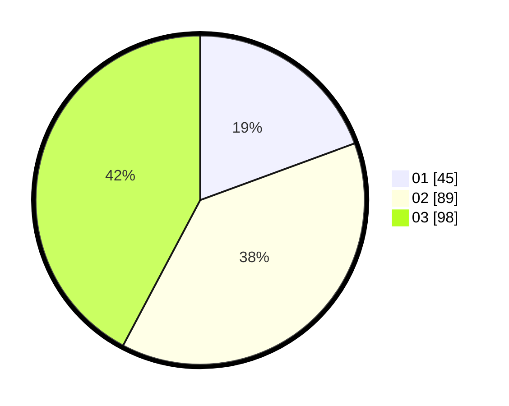

# Hasil

Hasil perolehan suara paslon dapat dilihat pada file paslon-01.txt, paslon-02.txt, dan paslon-03.txt.

Jika tidak ada, artinya data tersebut belum ada pada SIREKAP.

## Perolehan Suara

 * Paslon 01: **45**.
 * Paslon 02: **89**.
 * Paslon 03: **98**.

## Foto C Plano

https://sirekap-obj-formc.kpu.go.id/2081/pemilu/ppwp/31/73/05/10/05/3173051005120-20240215-000744--0974f4ff-9fb4-4905-bfb3-5efb3ae707d4.jpg

https://sirekap-obj-formc.kpu.go.id/2081/pemilu/ppwp/31/73/05/10/05/3173051005120-20240215-001033--6ae4c692-ae26-49fa-8a0c-74898e81859d.jpg

https://sirekap-obj-formc.kpu.go.id/2081/pemilu/ppwp/31/73/05/10/05/3173051005120-20240215-001326--d4723ca5-068e-4b53-9e31-d2c953094ee9.jpg
