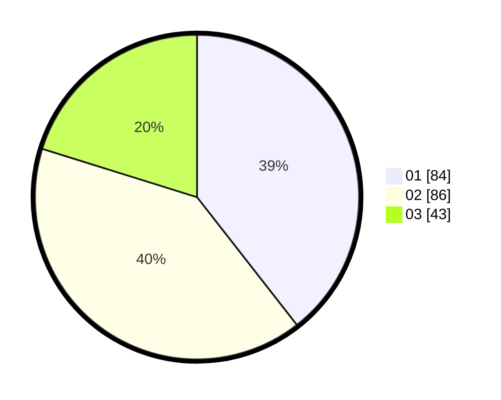

# Hasil

Hasil perolehan suara paslon dapat dilihat pada file paslon-01.txt, paslon-02.txt, dan paslon-03.txt.

Jika tidak ada, artinya data tersebut belum ada pada SIREKAP.

## Perolehan Suara

 * Paslon 01: **84**.
 * Paslon 02: **86**.
 * Paslon 03: **43**.

## Foto C Plano

https://sirekap-obj-formc.kpu.go.id/6407/pemilu/ppwp/31/73/05/10/05/3173051005124-20240216-120534--55895a80-f41d-44ef-96ff-3d1a48d3f98b.jpg

https://sirekap-obj-formc.kpu.go.id/6407/pemilu/ppwp/31/73/05/10/05/3173051005124-20240216-120538--ea9b3660-664f-4394-81bf-150c64900d20.jpg

https://sirekap-obj-formc.kpu.go.id/6407/pemilu/ppwp/31/73/05/10/05/3173051005124-20240216-120536--2efd5827-ddb7-4db4-b302-b2be25294a9b.jpg

## DATA PEMILIH TETAP

Jumlah pemilih dalam DPT: **290**.
 * L: **145**.
 * P: **145**.

## DATA PENGGUNA HAK PILIH

Jumlah pengguna hak pilih dalam DPT: **216**.
 * L: **103**.
 * P: **113**.

Jumlah pengguna hak pilih dalam DPTb: **2**.
 * L: **1**.
 * P: **1**.

Jumlah pengguna hak pilih dalam DPK: **0**.
 * L: **0**.
 * P: **0**.

Jumlah pengguna hak pilih: **218**.
 * L: **104**.
 * P: **114**.

## JUMLAH SUARA SAH DAN TIDAK SAH

JUMLAH SELURUH SUARA SAH: **213**.

JUMLAH SUARA TIDAK SAH: **5**.

JUMLAH SELURUH SUARA SAH DAN SUARA TIDAK SAH: **218**.
