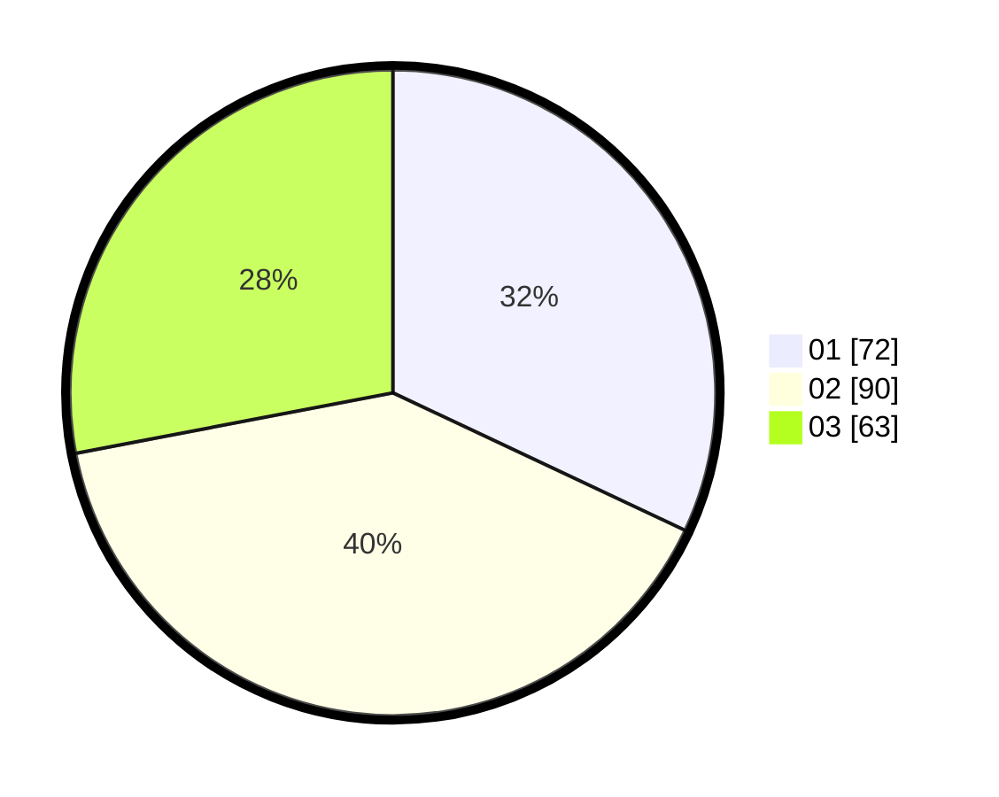

# Hasil

Hasil perolehan suara paslon dapat dilihat pada file paslon-01.txt, paslon-02.txt, dan paslon-03.txt.

Jika tidak ada, artinya data tersebut belum ada pada SIREKAP.

## Perolehan Suara

 * Paslon 01: **72**.
 * Paslon 02: **90**.
 * Paslon 03: **63**.

## Foto C Plano

https://sirekap-obj-formc.kpu.go.id/42ae/pemilu/ppwp/31/73/05/10/05/3173051005127-20240214-205234--12378b9e-fb6f-4a22-9a68-b1bfd42aafe9.jpg

https://sirekap-obj-formc.kpu.go.id/42ae/pemilu/ppwp/31/73/05/10/05/3173051005127-20240214-205221--652ee0f1-36f4-4b68-b7d2-3e6f12c6d10e.jpg

https://sirekap-obj-formc.kpu.go.id/42ae/pemilu/ppwp/31/73/05/10/05/3173051005127-20240214-205354--f1174e96-ca31-4c37-93f9-aca264115567.jpg
