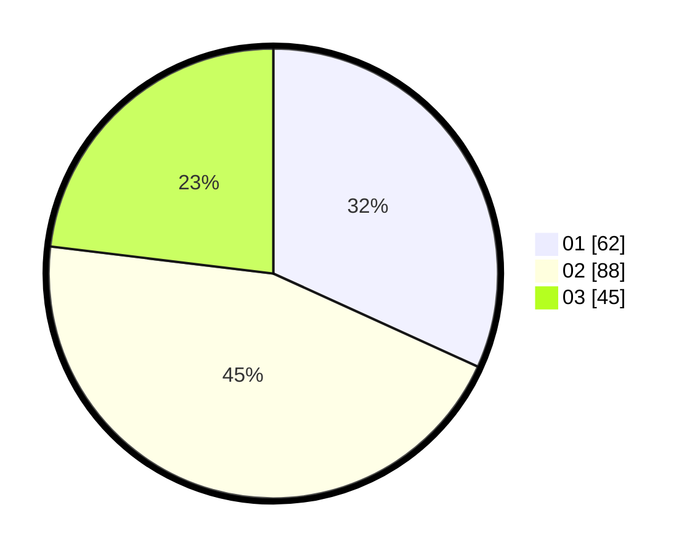

# Hasil

Hasil perolehan suara paslon dapat dilihat pada file paslon-01.txt, paslon-02.txt, dan paslon-03.txt.

Jika tidak ada, artinya data tersebut belum ada pada SIREKAP.

## Perolehan Suara

 * Paslon 01: **62**.
 * Paslon 02: **88**.
 * Paslon 03: **45**.

## Foto C Plano

https://sirekap-obj-formc.kpu.go.id/2cc9/pemilu/ppwp/31/73/05/10/05/3173051005128-20240214-232221--84797639-ef71-4210-b6fe-17d87a89c694.jpg

https://sirekap-obj-formc.kpu.go.id/2cc9/pemilu/ppwp/31/73/05/10/05/3173051005128-20240214-232629--84d7b5c4-0b65-49f8-9403-d44c20888203.jpg

https://sirekap-obj-formc.kpu.go.id/2cc9/pemilu/ppwp/31/73/05/10/05/3173051005128-20240214-232814--df5ba7fa-caf6-4131-a33d-99674552a4d4.jpg
