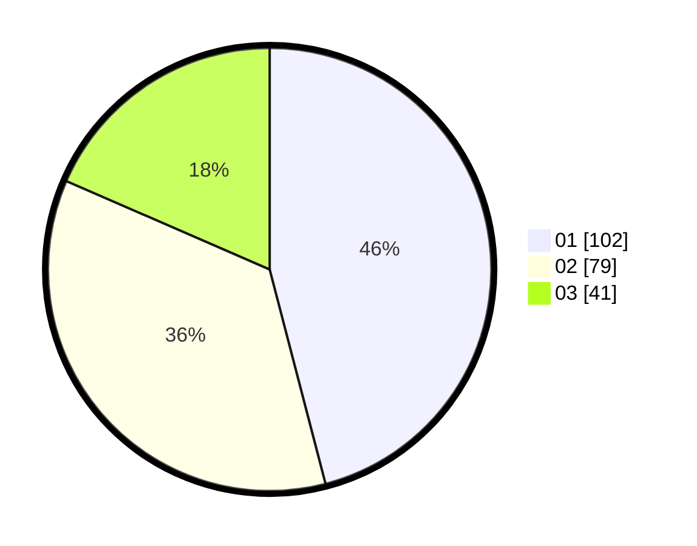

# Hasil

Hasil perolehan suara paslon dapat dilihat pada file paslon-01.txt, paslon-02.txt, dan paslon-03.txt.

Jika tidak ada, artinya data tersebut belum ada pada SIREKAP.

## Perolehan Suara

 * Paslon 01: **102**.
 * Paslon 02: **79**.
 * Paslon 03: **41**.

## Foto C Plano

https://sirekap-obj-formc.kpu.go.id/a3e9/pemilu/ppwp/31/73/05/10/05/3173051005129-20240214-191741--403f9e78-70b7-4c73-96b6-9553e264076c.jpg

https://sirekap-obj-formc.kpu.go.id/a3e9/pemilu/ppwp/31/73/05/10/05/3173051005129-20240214-213807--856ca0b6-e96f-4085-bce3-79dd1d5d759c.jpg

https://sirekap-obj-formc.kpu.go.id/a3e9/pemilu/ppwp/31/73/05/10/05/3173051005129-20240214-191752--90694135-ddd7-4195-9c11-3e5835a9acb9.jpg

## DATA PEMILIH TETAP

Jumlah pemilih dalam DPT: **289**.
 * L: **144**.
 * P: **145**.

## DATA PENGGUNA HAK PILIH

Jumlah pengguna hak pilih dalam DPT: **222**.
 * L: **103**.
 * P: **119**.

Jumlah pengguna hak pilih dalam DPTb: **0**.
 * L: **0**.
 * P: **0**.

Jumlah pengguna hak pilih dalam DPK: **3**.
 * L: **1**.
 * P: **2**.

Jumlah pengguna hak pilih: **225**.
 * L: **104**.
 * P: **121**.

## JUMLAH SUARA SAH DAN TIDAK SAH

JUMLAH SELURUH SUARA SAH: **222**.

JUMLAH SUARA TIDAK SAH: **3**.

JUMLAH SELURUH SUARA SAH DAN SUARA TIDAK SAH: **225**.
