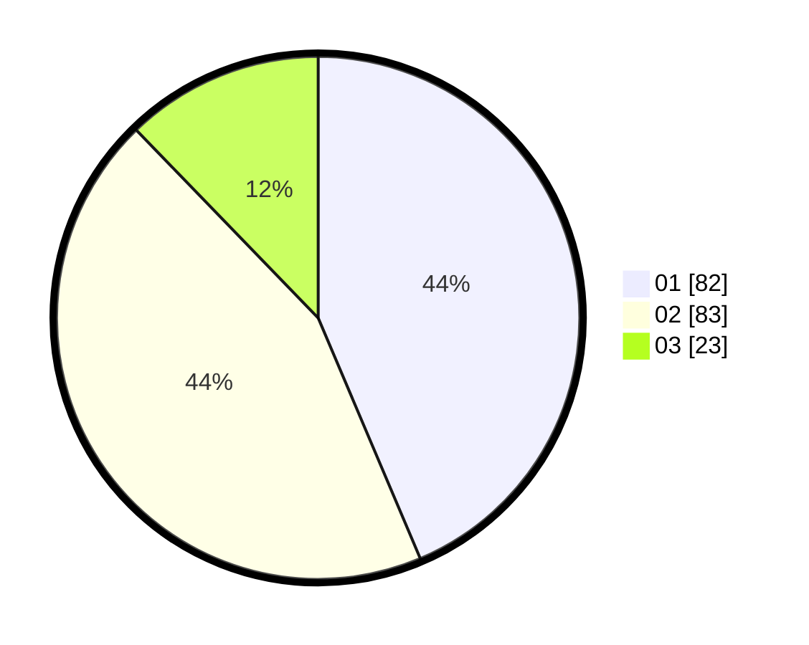

# Hasil

Hasil perolehan suara paslon dapat dilihat pada file paslon-01.txt, paslon-02.txt, dan paslon-03.txt.

Jika tidak ada, artinya data tersebut belum ada pada SIREKAP.

## Perolehan Suara

 * Paslon 01: **82**.
 * Paslon 02: **83**.
 * Paslon 03: **23**.

## Foto C Plano

https://sirekap-obj-formc.kpu.go.id/5cc0/pemilu/ppwp/31/73/05/10/05/3173051005139-20240215-000324--20174632-bec1-49f2-8b1e-f06c44d7cfcd.jpg

https://sirekap-obj-formc.kpu.go.id/5cc0/pemilu/ppwp/31/73/05/10/05/3173051005139-20240214-235156--d5a0a349-1cc3-4524-8c32-9d5f17750890.jpg
