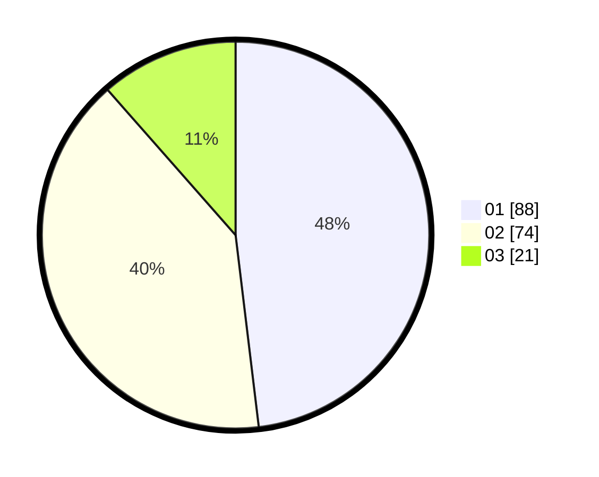

# Hasil

Hasil perolehan suara paslon dapat dilihat pada file paslon-01.txt, paslon-02.txt, dan paslon-03.txt.

Jika tidak ada, artinya data tersebut belum ada pada SIREKAP.

## Perolehan Suara

 * Paslon 01: **88**.
 * Paslon 02: **74**.
 * Paslon 03: **21**.

## Foto C Plano

https://sirekap-obj-formc.kpu.go.id/604e/pemilu/ppwp/31/73/05/10/05/3173051005141-20240215-001609--9b9f0368-a548-417a-9ad5-af95fa62b13a.jpg

https://sirekap-obj-formc.kpu.go.id/604e/pemilu/ppwp/31/73/05/10/05/3173051005141-20240215-001632--35575769-9738-4e24-98e2-2446eb57e597.jpg

https://sirekap-obj-formc.kpu.go.id/604e/pemilu/ppwp/31/73/05/10/05/3173051005141-20240215-001708--39989819-43b9-49bc-a1d8-772321076a7f.jpg
