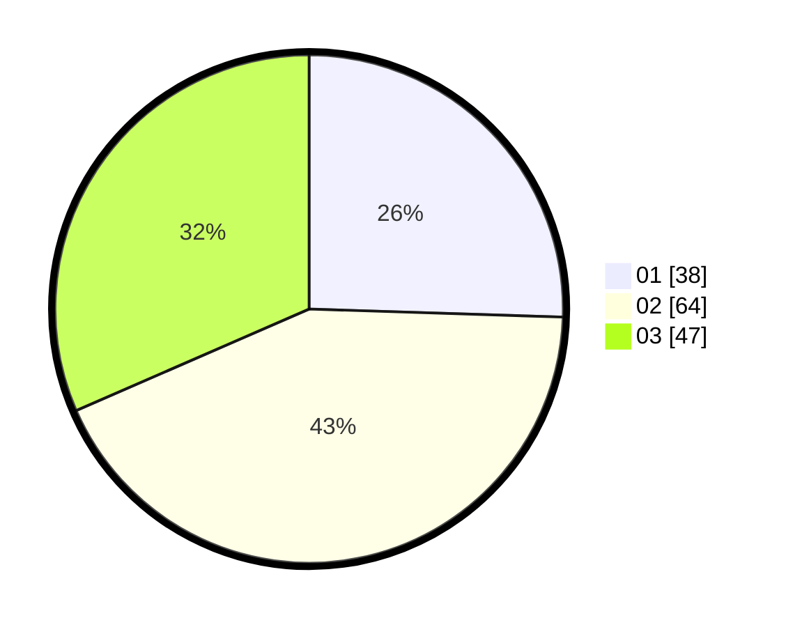

# Hasil

Hasil perolehan suara paslon dapat dilihat pada file paslon-01.txt, paslon-02.txt, dan paslon-03.txt.

Jika tidak ada, artinya data tersebut belum ada pada SIREKAP.

## Perolehan Suara

 * Paslon 01: **38**.
 * Paslon 02: **64**.
 * Paslon 03: **47**.

## Foto C Plano

https://sirekap-obj-formc.kpu.go.id/6087/pemilu/ppwp/31/73/05/10/05/3173051005144-20240214-190737--ceefca86-8ee1-48f2-b012-e3752268557a.jpg

https://sirekap-obj-formc.kpu.go.id/6087/pemilu/ppwp/31/73/05/10/05/3173051005144-20240214-192122--4d47e62a-4093-4175-8e53-95a306e96a7d.jpg

https://sirekap-obj-formc.kpu.go.id/6087/pemilu/ppwp/31/73/05/10/05/3173051005144-20240214-192239--819930eb-8bc2-4d02-9f92-1a9ef447b976.jpg

## DATA PEMILIH TETAP

Jumlah pemilih dalam DPT: **289**.
 * L: **139**.
 * P: **150**.

## DATA PENGGUNA HAK PILIH

Jumlah pengguna hak pilih dalam DPT: **140**.
 * L: **64**.
 * P: **76**.

Jumlah pengguna hak pilih dalam DPTb: **0**.
 * L: **0**.
 * P: **0**.

Jumlah pengguna hak pilih dalam DPK: **11**.
 * L: **5**.
 * P: **6**.

Jumlah pengguna hak pilih: **151**.
 * L: **69**.
 * P: **82**.

## JUMLAH SUARA SAH DAN TIDAK SAH

JUMLAH SELURUH SUARA SAH: **149**.

JUMLAH SUARA TIDAK SAH: **2**.

JUMLAH SELURUH SUARA SAH DAN SUARA TIDAK SAH: **151**.
