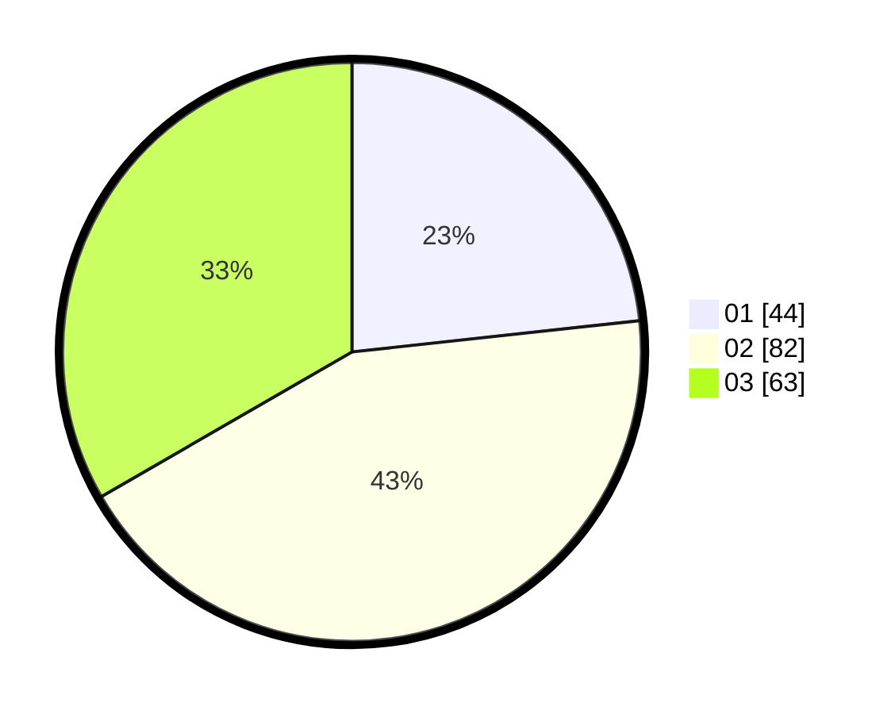

# Hasil

Hasil perolehan suara paslon dapat dilihat pada file paslon-01.txt, paslon-02.txt, dan paslon-03.txt.

Jika tidak ada, artinya data tersebut belum ada pada SIREKAP.

## Perolehan Suara

 * Paslon 01: **44**.
 * Paslon 02: **82**.
 * Paslon 03: **63**.

## Foto C Plano

https://sirekap-obj-formc.kpu.go.id/ad0c/pemilu/ppwp/31/73/05/10/05/3173051005145-20240214-213547--e16527f4-a973-4815-a680-4e9fa6084a44.jpg

https://sirekap-obj-formc.kpu.go.id/ad0c/pemilu/ppwp/31/73/05/10/05/3173051005145-20240214-231435--72cc8d54-60b0-4a3d-b255-53519ae57375.jpg

https://sirekap-obj-formc.kpu.go.id/ad0c/pemilu/ppwp/31/73/05/10/05/3173051005145-20240214-231627--5663ff56-4730-4747-81f7-3b06b9c0ee22.jpg
