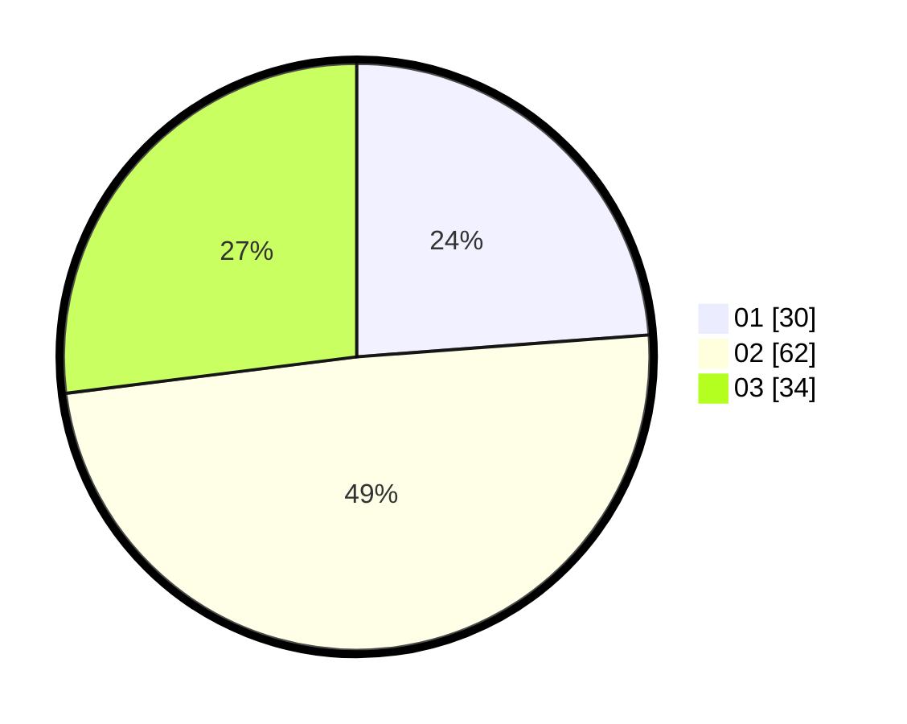

# Hasil

Hasil perolehan suara paslon dapat dilihat pada file paslon-01.txt, paslon-02.txt, dan paslon-03.txt.

Jika tidak ada, artinya data tersebut belum ada pada SIREKAP.

## Perolehan Suara

 * Paslon 01: **30**.
 * Paslon 02: **62**.
 * Paslon 03: **34**.

## Foto C Plano

https://sirekap-obj-formc.kpu.go.id/cfc1/pemilu/ppwp/31/73/05/10/05/3173051005146-20240214-155752--fc0005f2-b47d-486c-babe-be9509746237.jpg

https://sirekap-obj-formc.kpu.go.id/cfc1/pemilu/ppwp/31/73/05/10/05/3173051005146-20240214-155909--9adf5767-a00f-4fd7-b4e2-0af11b33d0f0.jpg

https://sirekap-obj-formc.kpu.go.id/cfc1/pemilu/ppwp/31/73/05/10/05/3173051005146-20240214-221411--dc38474f-37b8-4264-a77f-998f33c36705.jpg
