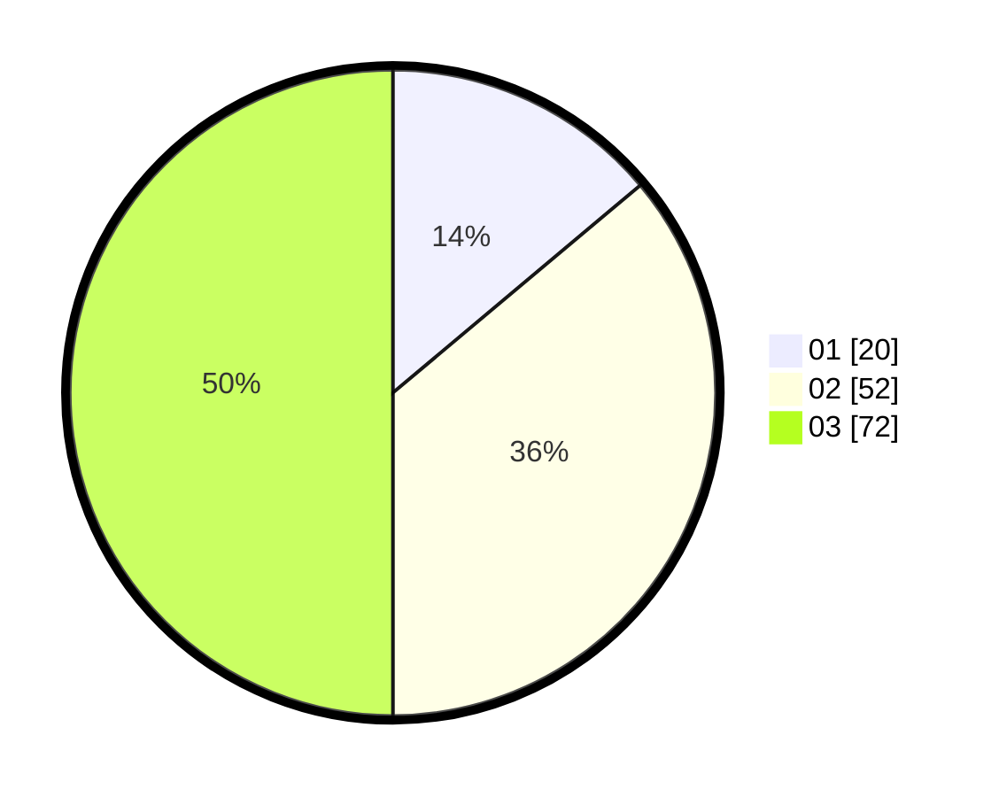

# Hasil

Hasil perolehan suara paslon dapat dilihat pada file paslon-01.txt, paslon-02.txt, dan paslon-03.txt.

Jika tidak ada, artinya data tersebut belum ada pada SIREKAP.

## Perolehan Suara

 * Paslon 01: **20**.
 * Paslon 02: **52**.
 * Paslon 03: **72**.

## Foto C Plano

https://sirekap-obj-formc.kpu.go.id/6dcc/pemilu/ppwp/31/73/05/10/05/3173051005149-20240215-020913--2eed3405-22bc-40db-9fba-8d5ee8b68fa7.jpg

https://sirekap-obj-formc.kpu.go.id/6dcc/pemilu/ppwp/31/73/05/10/05/3173051005149-20240215-020935--b9d0e362-ba00-4b25-bbb9-5fde39f65010.jpg

https://sirekap-obj-formc.kpu.go.id/6dcc/pemilu/ppwp/31/73/05/10/05/3173051005149-20240214-211743--ab7943bb-be10-45c6-ab8e-e9b66fbb1ffd.jpg
