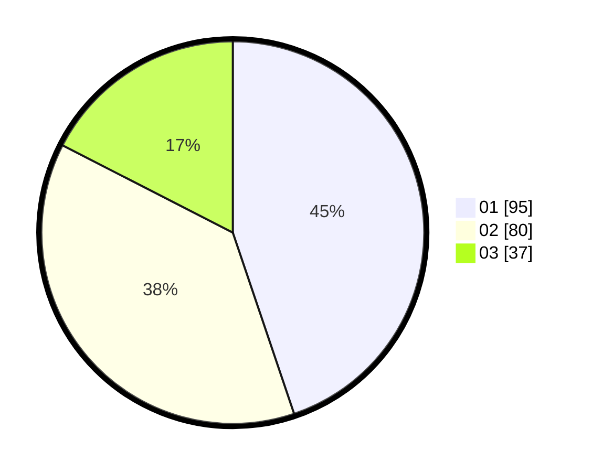

# Hasil

Hasil perolehan suara paslon dapat dilihat pada file paslon-01.txt, paslon-02.txt, dan paslon-03.txt.

Jika tidak ada, artinya data tersebut belum ada pada SIREKAP.

## Perolehan Suara

 * Paslon 01: **95**.
 * Paslon 02: **80**.
 * Paslon 03: **37**.

## Foto C Plano

https://sirekap-obj-formc.kpu.go.id/d920/pemilu/ppwp/31/73/05/10/05/3173051005160-20240215-043819--ac322ce2-9882-4a03-aa85-85539df3d09d.jpg

https://sirekap-obj-formc.kpu.go.id/d920/pemilu/ppwp/31/73/05/10/05/3173051005160-20240216-004402--1ab3b787-d65d-4474-962b-10fcf370f1e5.jpg

https://sirekap-obj-formc.kpu.go.id/d920/pemilu/ppwp/31/73/05/10/05/3173051005160-20240215-043830--b57fd7fe-ca6c-4b35-b42c-b7785818a360.jpg

## DATA PEMILIH TETAP

Jumlah pemilih dalam DPT: **279**.
 * L: **152**.
 * P: **127**.

## DATA PENGGUNA HAK PILIH

Jumlah pengguna hak pilih dalam DPT: **210**.
 * L: **110**.
 * P: **100**.

Jumlah pengguna hak pilih dalam DPTb: **2**.
 * L: **1**.
 * P: **1**.

Jumlah pengguna hak pilih dalam DPK: **4**.
 * L: **1**.
 * P: **3**.

Jumlah pengguna hak pilih: **216**.
 * L: **112**.
 * P: **104**.

## JUMLAH SUARA SAH DAN TIDAK SAH

JUMLAH SELURUH SUARA SAH: **212**.

JUMLAH SUARA TIDAK SAH: **4**.

JUMLAH SELURUH SUARA SAH DAN SUARA TIDAK SAH: **216**.
