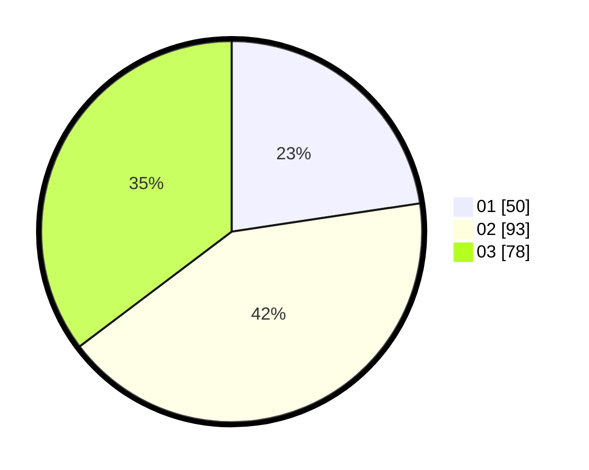

# Hasil

Hasil perolehan suara paslon dapat dilihat pada file paslon-01.txt, paslon-02.txt, dan paslon-03.txt.

Jika tidak ada, artinya data tersebut belum ada pada SIREKAP.

## Perolehan Suara

 * Paslon 01: **50**.
 * Paslon 02: **93**.
 * Paslon 03: **78**.

## Foto C Plano

https://sirekap-obj-formc.kpu.go.id/debc/pemilu/ppwp/31/73/05/10/05/3173051005164-20240214-203406--8b1489e8-3170-4d10-bf79-b9e4015b13b4.jpg

https://sirekap-obj-formc.kpu.go.id/debc/pemilu/ppwp/31/73/05/10/05/3173051005164-20240214-203458--e1356e43-e456-460c-9732-61e29ee42978.jpg

https://sirekap-obj-formc.kpu.go.id/debc/pemilu/ppwp/31/73/05/10/05/3173051005164-20240214-191812--de317ff6-192c-4f4e-8f8b-629efbaa3ecc.jpg
