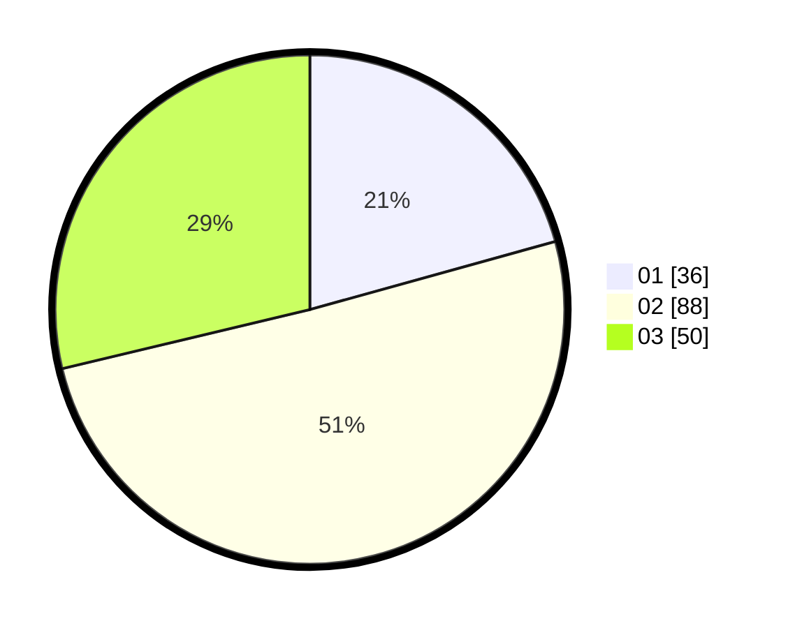

# Hasil

Hasil perolehan suara paslon dapat dilihat pada file paslon-01.txt, paslon-02.txt, dan paslon-03.txt.

Jika tidak ada, artinya data tersebut belum ada pada SIREKAP.

## Perolehan Suara

 * Paslon 01: **36**.
 * Paslon 02: **88**.
 * Paslon 03: **50**.

## Foto C Plano

https://sirekap-obj-formc.kpu.go.id/1ce1/pemilu/ppwp/31/73/05/10/05/3173051005166-20240215-032329--60a50324-3e24-4d56-9950-ebd9e6f7edbd.jpg

https://sirekap-obj-formc.kpu.go.id/1ce1/pemilu/ppwp/31/73/05/10/05/3173051005166-20240215-135729--0baebbe5-9018-46c9-8881-9261663bcfd3.jpg

https://sirekap-obj-formc.kpu.go.id/1ce1/pemilu/ppwp/31/73/05/10/05/3173051005166-20240215-135951--6943da16-ce2f-4a30-8a28-62e62a30b497.jpg
