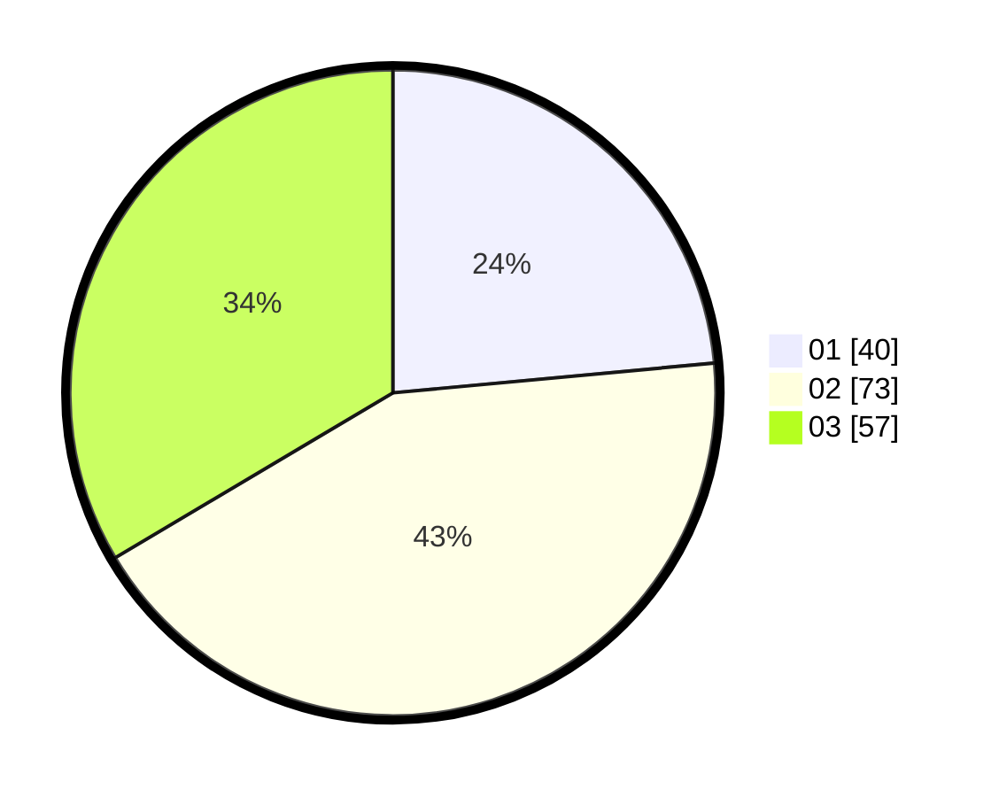

# Hasil

Hasil perolehan suara paslon dapat dilihat pada file paslon-01.txt, paslon-02.txt, dan paslon-03.txt.

Jika tidak ada, artinya data tersebut belum ada pada SIREKAP.

## Perolehan Suara

 * Paslon 01: **40**.
 * Paslon 02: **73**.
 * Paslon 03: **57**.

## Foto C Plano

https://sirekap-obj-formc.kpu.go.id/dbd4/pemilu/ppwp/31/73/05/10/05/3173051005167-20240215-004241--395ed167-c957-4f70-89e0-e68105f6a73d.jpg

https://sirekap-obj-formc.kpu.go.id/dbd4/pemilu/ppwp/31/73/05/10/05/3173051005167-20240215-004820--008cd9e8-89d4-4a70-926c-730e7ab1a1ad.jpg

https://sirekap-obj-formc.kpu.go.id/dbd4/pemilu/ppwp/31/73/05/10/05/3173051005167-20240215-004652--88f22fd0-799b-43fc-9e5b-89d002e2c45f.jpg

## DATA PEMILIH TETAP

Jumlah pemilih dalam DPT: **226**.
 * L: **113**.
 * P: **113**.

## DATA PENGGUNA HAK PILIH

Jumlah pengguna hak pilih dalam DPT: **165**.
 * L: **80**.
 * P: **85**.

Jumlah pengguna hak pilih dalam DPTb: **0**.
 * L: **0**.
 * P: **0**.

Jumlah pengguna hak pilih dalam DPK: **7**.
 * L: **4**.
 * P: **3**.

Jumlah pengguna hak pilih: **172**.
 * L: **84**.
 * P: **88**.

## JUMLAH SUARA SAH DAN TIDAK SAH

JUMLAH SELURUH SUARA SAH: **170**.

JUMLAH SUARA TIDAK SAH: **2**.

JUMLAH SELURUH SUARA SAH DAN SUARA TIDAK SAH: **172**.
