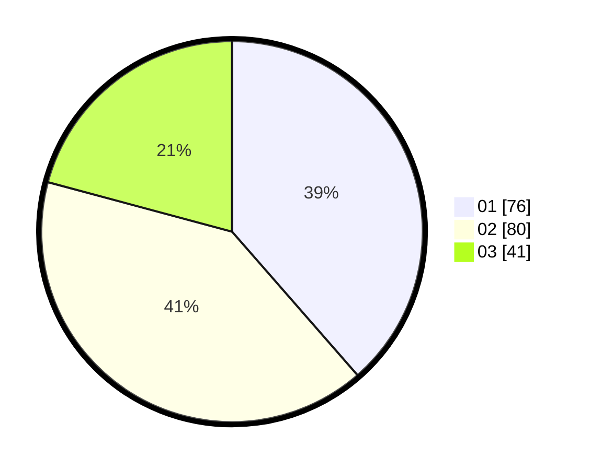

# Hasil

Hasil perolehan suara paslon dapat dilihat pada file paslon-01.txt, paslon-02.txt, dan paslon-03.txt.

Jika tidak ada, artinya data tersebut belum ada pada SIREKAP.

## Perolehan Suara

 * Paslon 01: **76**.
 * Paslon 02: **80**.
 * Paslon 03: **41**.

## Foto C Plano

https://sirekap-obj-formc.kpu.go.id/28a6/pemilu/ppwp/31/73/05/10/05/3173051005168-20240214-233933--637ccfd7-7c76-4325-a3dc-ce30618ed9bb.jpg

https://sirekap-obj-formc.kpu.go.id/28a6/pemilu/ppwp/31/73/05/10/05/3173051005168-20240214-234033--b997fb8f-f1ab-4028-8909-8ebd63403201.jpg

https://sirekap-obj-formc.kpu.go.id/28a6/pemilu/ppwp/31/73/05/10/05/3173051005168-20240214-234131--8f6f0a9e-9c0b-451f-849e-77e1b2e2e22b.jpg
