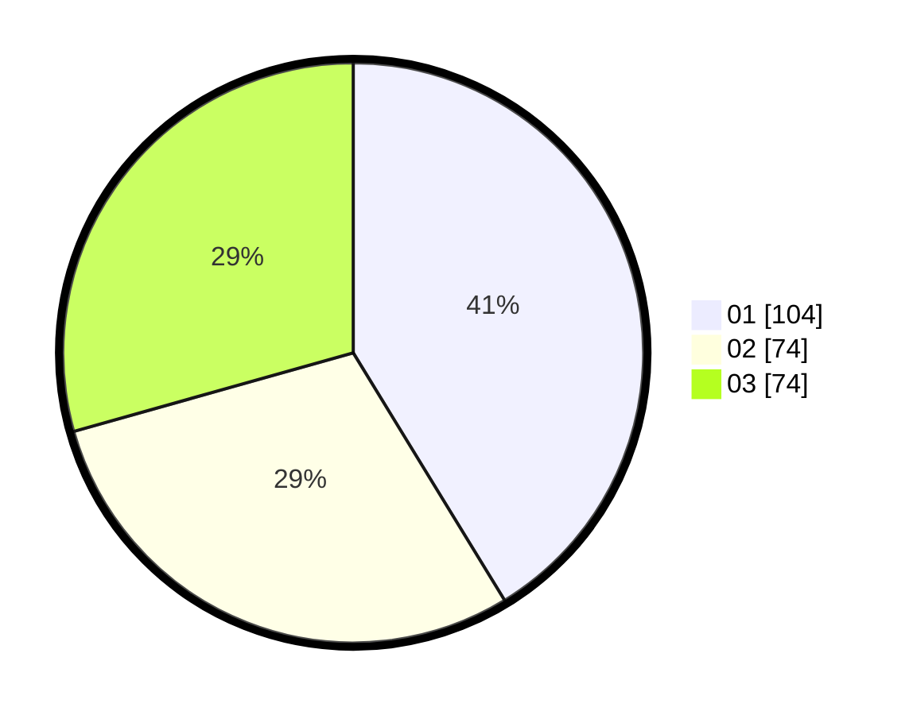

# Hasil

Hasil perolehan suara paslon dapat dilihat pada file paslon-01.txt, paslon-02.txt, dan paslon-03.txt.

Jika tidak ada, artinya data tersebut belum ada pada SIREKAP.

## Perolehan Suara

 * Paslon 01: **104**.
 * Paslon 02: **74**.
 * Paslon 03: **74**.

## Foto C Plano

https://sirekap-obj-formc.kpu.go.id/ceed/pemilu/ppwp/31/73/05/10/05/3173051005169-20240215-001237--861b0d0c-43bf-499e-ac5f-0ef421300e4f.jpg

https://sirekap-obj-formc.kpu.go.id/ceed/pemilu/ppwp/31/73/05/10/05/3173051005169-20240215-194604--e8ee91e8-53e1-46bc-8f4c-2327beb04703.jpg

https://sirekap-obj-formc.kpu.go.id/ceed/pemilu/ppwp/31/73/05/10/05/3173051005169-20240215-001245--29cecf6f-9a2e-4b6d-af38-800065a36b18.jpg

## DATA PEMILIH TETAP

Jumlah pemilih dalam DPT: **286**.
 * L: **137**.
 * P: **149**.

## DATA PENGGUNA HAK PILIH

Jumlah pengguna hak pilih dalam DPT: **228**.
 * L: **101**.
 * P: **127**.

Jumlah pengguna hak pilih dalam DPTb: **0**.
 * L: **0**.
 * P: **0**.

Jumlah pengguna hak pilih dalam DPK: **0**.
 * L: **0**.
 * P: **0**.

Jumlah pengguna hak pilih: **228**.
 * L: **101**.
 * P: **127**.

## JUMLAH SUARA SAH DAN TIDAK SAH

JUMLAH SELURUH SUARA SAH: **223**.

JUMLAH SUARA TIDAK SAH: **5**.

JUMLAH SELURUH SUARA SAH DAN SUARA TIDAK SAH: **228**.
