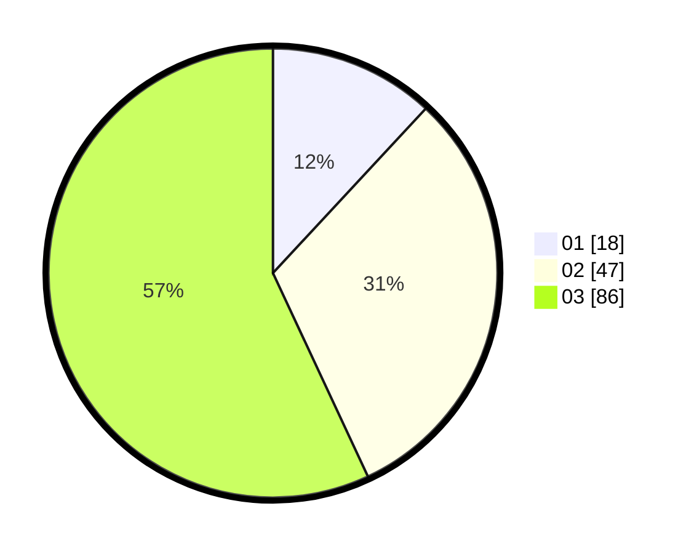

# Hasil

Hasil perolehan suara paslon dapat dilihat pada file paslon-01.txt, paslon-02.txt, dan paslon-03.txt.

Jika tidak ada, artinya data tersebut belum ada pada SIREKAP.

## Perolehan Suara

 * Paslon 01: **18**.
 * Paslon 02: **47**.
 * Paslon 03: **86**.

## Foto C Plano

https://sirekap-obj-formc.kpu.go.id/ca0a/pemilu/ppwp/31/73/05/10/05/3173051005180-20240214-220247--f6d84989-9b9b-478c-9875-0b00cd564120.jpg

https://sirekap-obj-formc.kpu.go.id/ca0a/pemilu/ppwp/31/73/05/10/05/3173051005180-20240214-220344--0f02e0b6-f739-44d5-a99c-ac54b0ef538b.jpg

https://sirekap-obj-formc.kpu.go.id/ca0a/pemilu/ppwp/31/73/05/10/05/3173051005180-20240214-220409--59026d32-0732-4aaf-ace1-11ea85e5f1b2.jpg

## DATA PEMILIH TETAP

Jumlah pemilih dalam DPT: **267**.
 * L: **128**.
 * P: **139**.

## DATA PENGGUNA HAK PILIH

Jumlah pengguna hak pilih dalam DPT: **203**.
 * L: **99**.
 * P: **104**.

Jumlah pengguna hak pilih dalam DPTb: **0**.
 * L: **0**.
 * P: **0**.

Jumlah pengguna hak pilih dalam DPK: **0**.
 * L: **0**.
 * P: **0**.

Jumlah pengguna hak pilih: **203**.
 * L: **99**.
 * P: **104**.

## JUMLAH SUARA SAH DAN TIDAK SAH

JUMLAH SELURUH SUARA SAH: **201**.

JUMLAH SUARA TIDAK SAH: **2**.

JUMLAH SELURUH SUARA SAH DAN SUARA TIDAK SAH: **203**.
