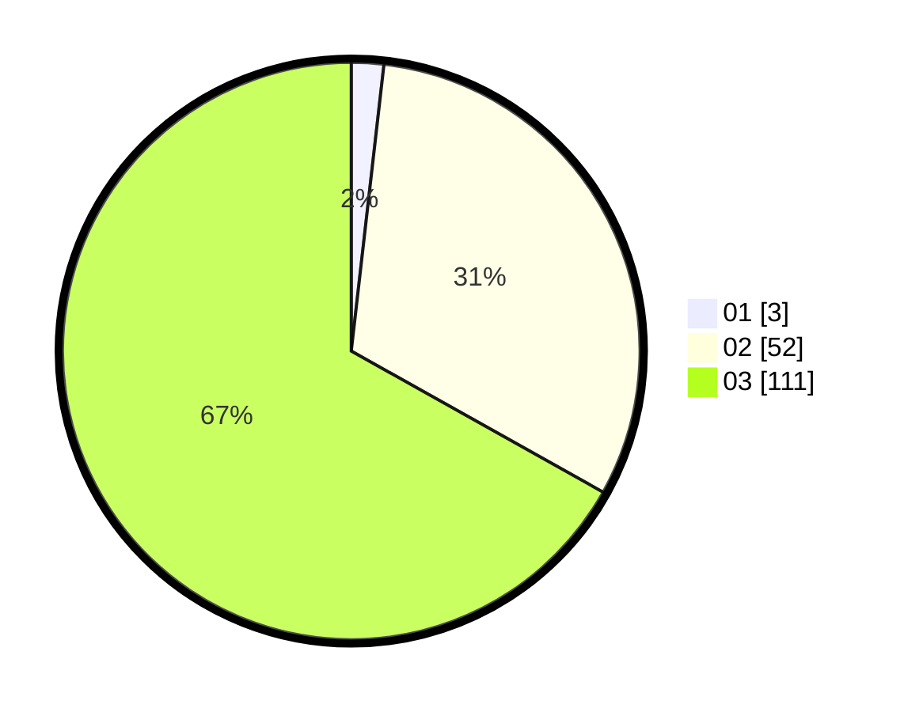

# Hasil

Hasil perolehan suara paslon dapat dilihat pada file paslon-01.txt, paslon-02.txt, dan paslon-03.txt.

Jika tidak ada, artinya data tersebut belum ada pada SIREKAP.

## Perolehan Suara

 * Paslon 01: **3**.
 * Paslon 02: **52**.
 * Paslon 03: **111**.

## Foto C Plano

https://sirekap-obj-formc.kpu.go.id/64b0/pemilu/ppwp/31/73/05/10/05/3173051005182-20240214-200749--834c5152-36bf-4405-878d-b97c244cb84d.jpg

https://sirekap-obj-formc.kpu.go.id/64b0/pemilu/ppwp/31/73/05/10/05/3173051005182-20240214-204446--0ecf10c3-2c6a-41d6-9abb-96bffdde5148.jpg

https://sirekap-obj-formc.kpu.go.id/64b0/pemilu/ppwp/31/73/05/10/05/3173051005182-20240214-204536--a8363bd6-c8d2-450c-b2f3-def439077f8b.jpg

## DATA PEMILIH TETAP

Jumlah pemilih dalam DPT: **272**.
 * L: **129**.
 * P: **143**.

## DATA PENGGUNA HAK PILIH

Jumlah pengguna hak pilih dalam DPT: **171**.
 * L: **83**.
 * P: **88**.

Jumlah pengguna hak pilih dalam DPTb: **0**.
 * L: **0**.
 * P: **0**.

Jumlah pengguna hak pilih dalam DPK: **1**.
 * L: **0**.
 * P: **1**.

Jumlah pengguna hak pilih: **172**.
 * L: **83**.
 * P: **89**.

## JUMLAH SUARA SAH DAN TIDAK SAH

JUMLAH SELURUH SUARA SAH: **166**.

JUMLAH SUARA TIDAK SAH: **6**.

JUMLAH SELURUH SUARA SAH DAN SUARA TIDAK SAH: **172**.
