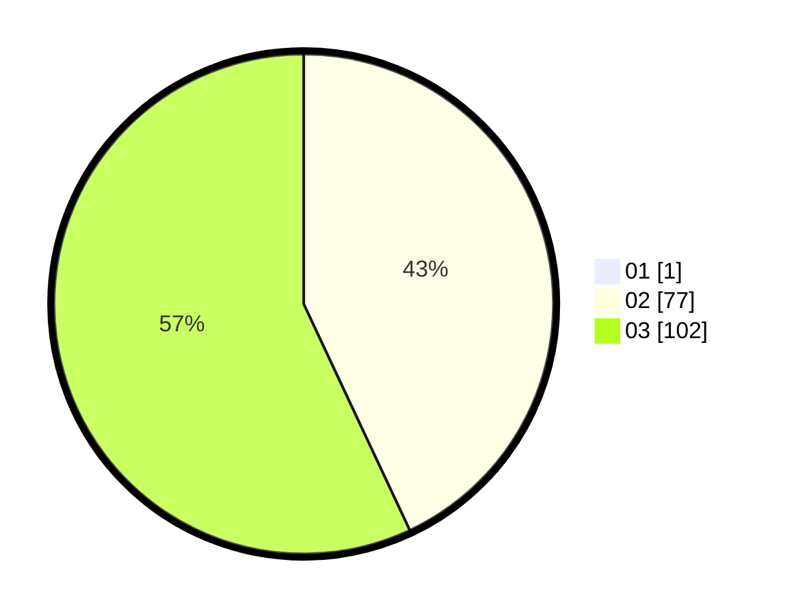

# Hasil

Hasil perolehan suara paslon dapat dilihat pada file paslon-01.txt, paslon-02.txt, dan paslon-03.txt.

Jika tidak ada, artinya data tersebut belum ada pada SIREKAP.

## Perolehan Suara

 * Paslon 01: **1**.
 * Paslon 02: **77**.
 * Paslon 03: **102**.

## Foto C Plano

https://sirekap-obj-formc.kpu.go.id/9aa1/pemilu/ppwp/31/73/05/10/05/3173051005183-20240214-195231--a218ec71-4056-45f4-a29f-69f7ff0b74ed.jpg

https://sirekap-obj-formc.kpu.go.id/9aa1/pemilu/ppwp/31/73/05/10/05/3173051005183-20240214-195518--99257396-2778-4f16-a81a-1fa3380b97f9.jpg

https://sirekap-obj-formc.kpu.go.id/9aa1/pemilu/ppwp/31/73/05/10/05/3173051005183-20240214-195740--fb05c4e7-8ca4-43d4-8305-75da1c93d990.jpg

## DATA PEMILIH TETAP

Jumlah pemilih dalam DPT: **278**.
 * L: **132**.
 * P: **146**.

## DATA PENGGUNA HAK PILIH

Jumlah pengguna hak pilih dalam DPT: **173**.
 * L: **79**.
 * P: **94**.

Jumlah pengguna hak pilih dalam DPTb: **0**.
 * L: **0**.
 * P: **0**.

Jumlah pengguna hak pilih dalam DPK: **8**.
 * L: **4**.
 * P: **4**.

Jumlah pengguna hak pilih: **181**.
 * L: **83**.
 * P: **98**.

## JUMLAH SUARA SAH DAN TIDAK SAH

JUMLAH SELURUH SUARA SAH: **180**.

JUMLAH SUARA TIDAK SAH: **1**.

JUMLAH SELURUH SUARA SAH DAN SUARA TIDAK SAH: **181**.
