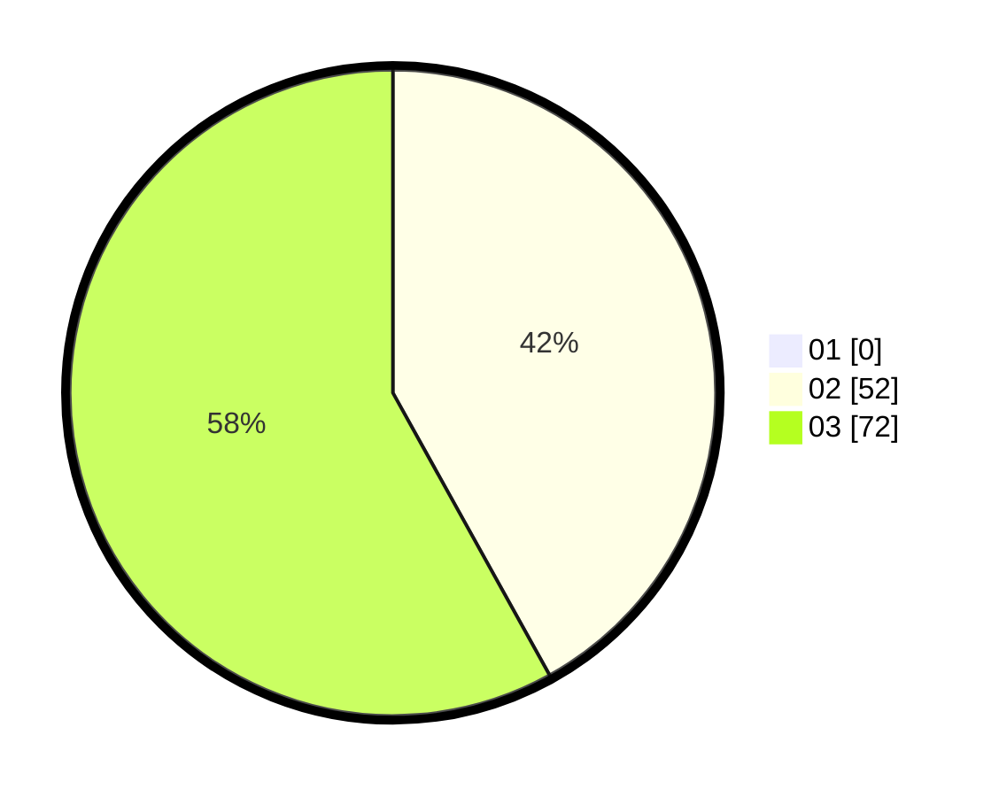

# Hasil

Hasil perolehan suara paslon dapat dilihat pada file paslon-01.txt, paslon-02.txt, dan paslon-03.txt.

Jika tidak ada, artinya data tersebut belum ada pada SIREKAP.

## Perolehan Suara

 * Paslon 01: **0**.
 * Paslon 02: **52**.
 * Paslon 03: **72**.

## Foto C Plano

https://sirekap-obj-formc.kpu.go.id/cd5c/pemilu/ppwp/31/73/05/10/05/3173051005185-20240214-211133--ed5f9409-910c-470b-ad0b-570259d91f74.jpg

https://sirekap-obj-formc.kpu.go.id/cd5c/pemilu/ppwp/31/73/05/10/05/3173051005185-20240214-211241--55375786-9109-4ea8-9f0b-9183ac6f61ba.jpg

https://sirekap-obj-formc.kpu.go.id/cd5c/pemilu/ppwp/31/73/05/10/05/3173051005185-20240214-211330--dcefe10b-8759-4b31-9652-86167812307a.jpg
