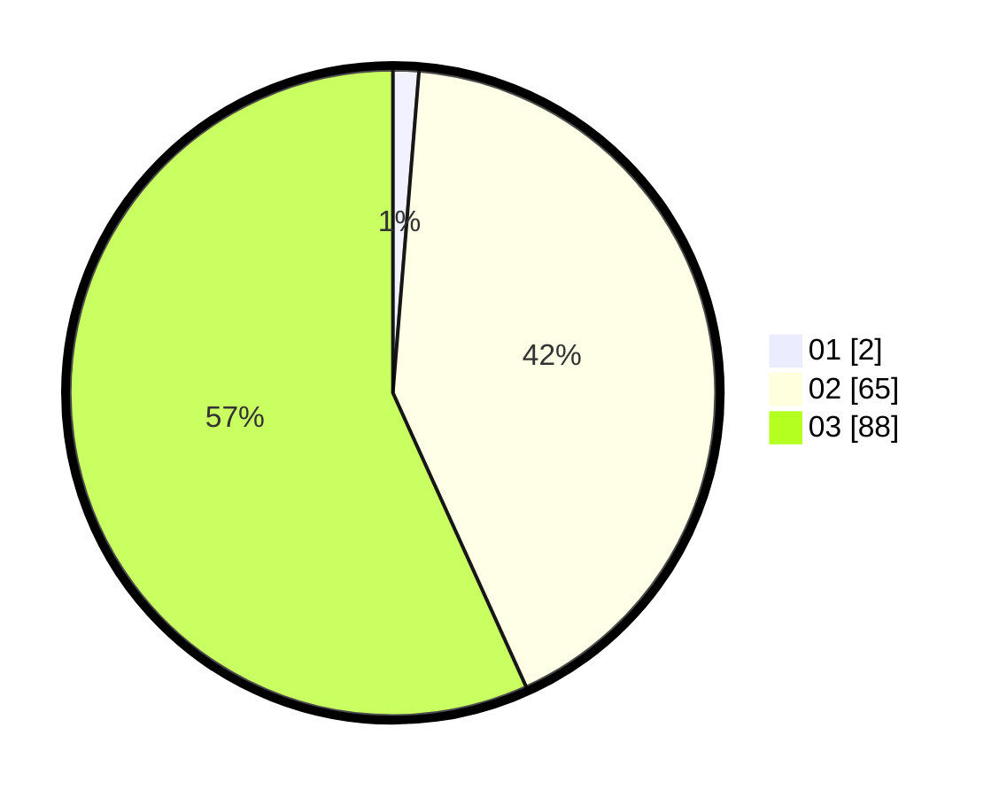

# Hasil

Hasil perolehan suara paslon dapat dilihat pada file paslon-01.txt, paslon-02.txt, dan paslon-03.txt.

Jika tidak ada, artinya data tersebut belum ada pada SIREKAP.

## Perolehan Suara

 * Paslon 01: **2**.
 * Paslon 02: **65**.
 * Paslon 03: **88**.

## Foto C Plano

https://sirekap-obj-formc.kpu.go.id/3167/pemilu/ppwp/31/73/05/10/05/3173051005186-20240214-191715--6ecf7e7a-163a-4d18-ac65-c6b623e16f45.jpg

https://sirekap-obj-formc.kpu.go.id/3167/pemilu/ppwp/31/73/05/10/05/3173051005186-20240214-192159--b90662f5-f981-4985-8b1d-43f1f481499b.jpg

https://sirekap-obj-formc.kpu.go.id/3167/pemilu/ppwp/31/73/05/10/05/3173051005186-20240214-191923--7bda9b09-0b87-4dac-9081-453327ef6b1e.jpg
